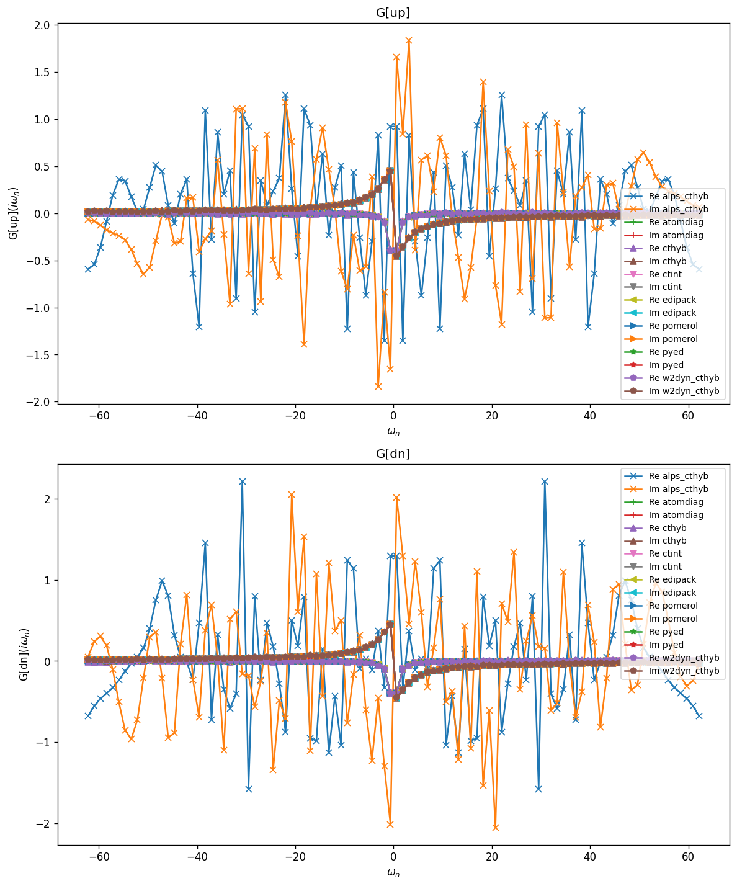
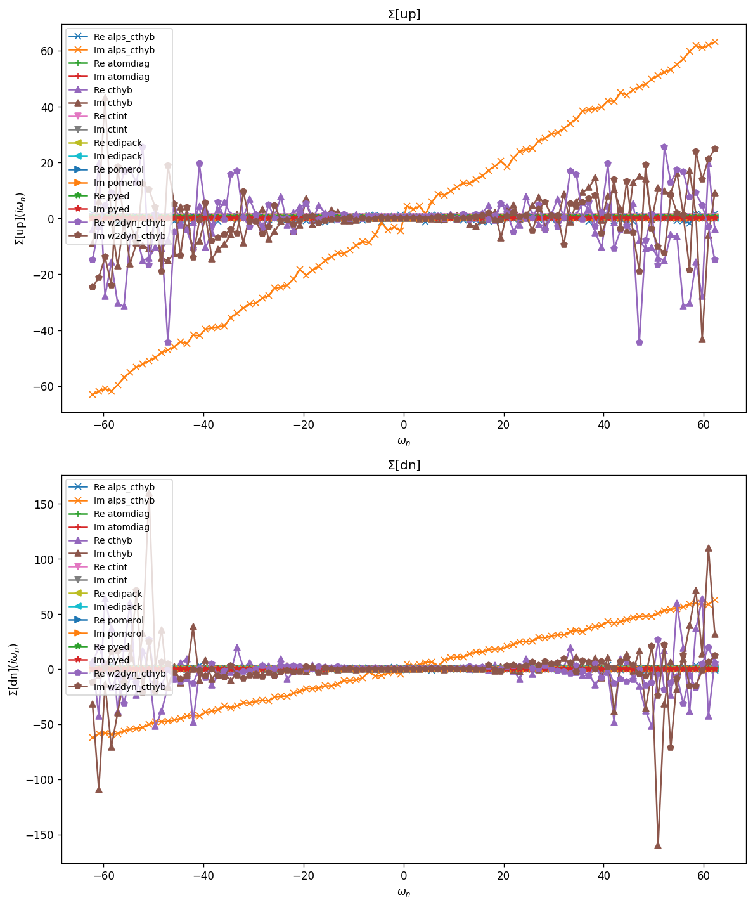
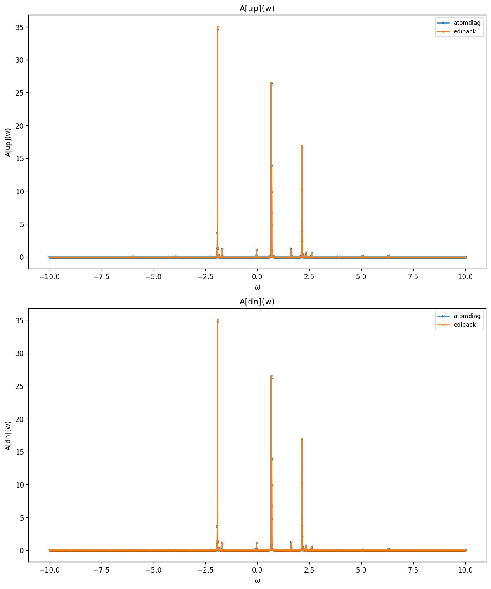
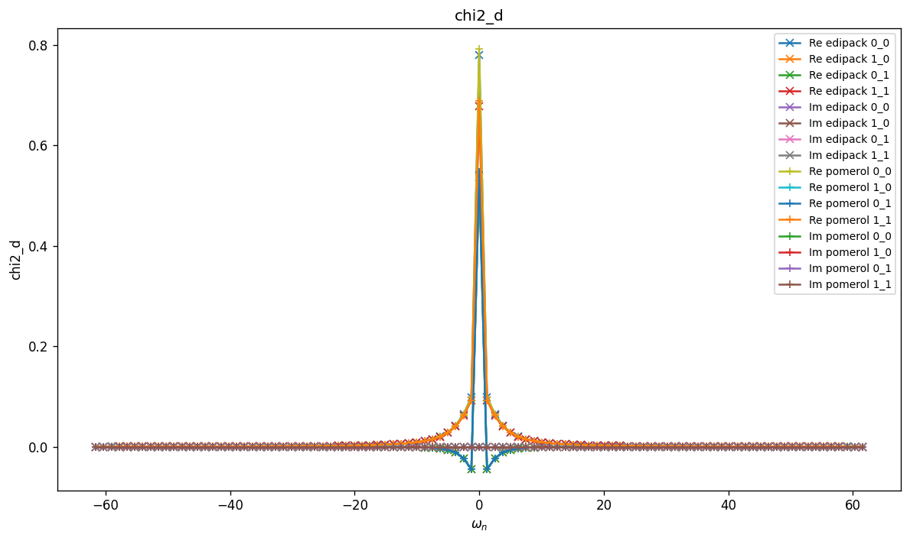
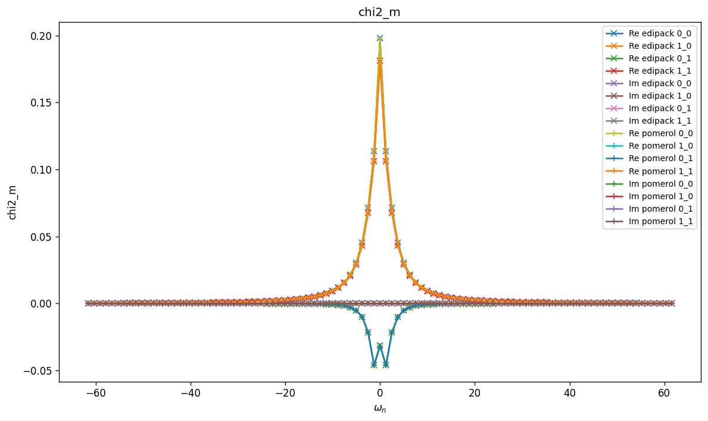
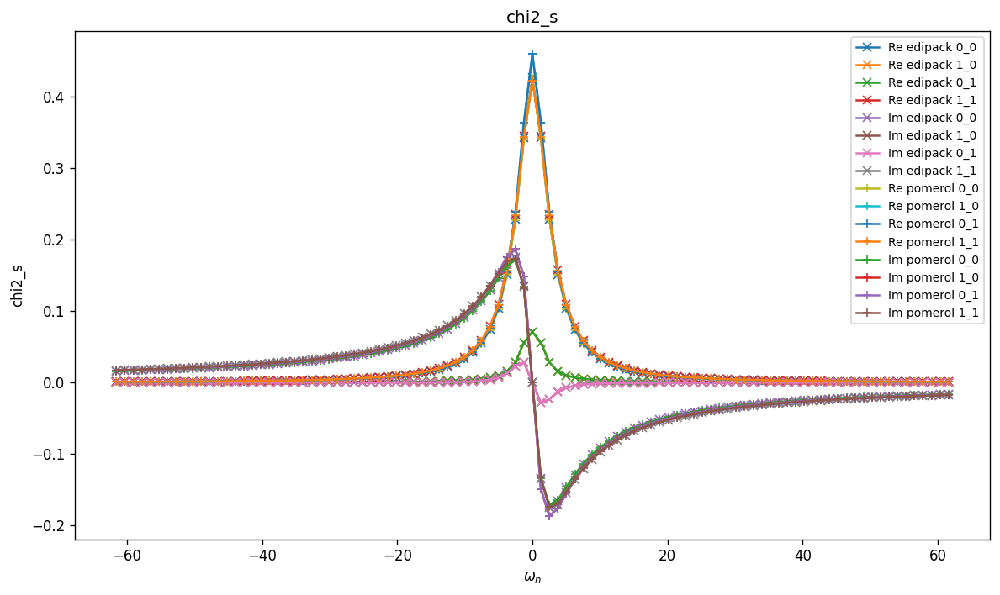
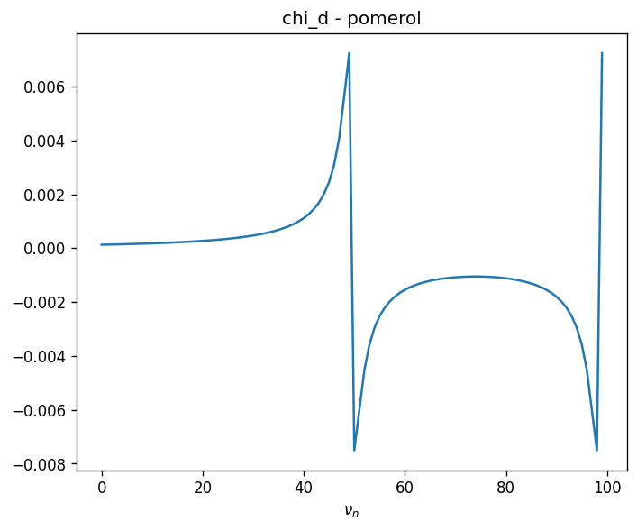
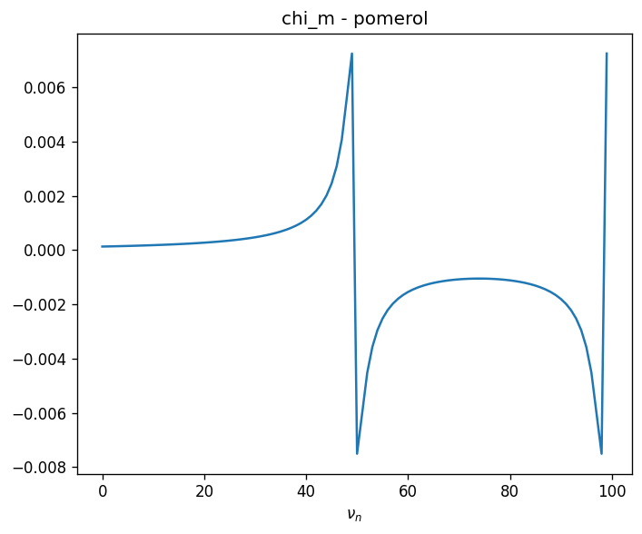
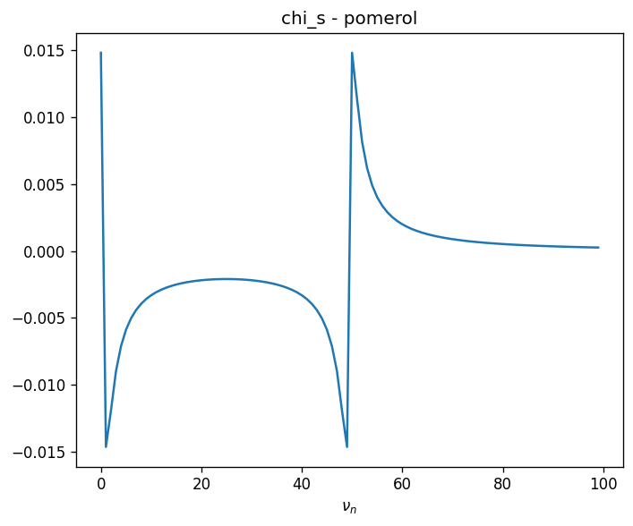
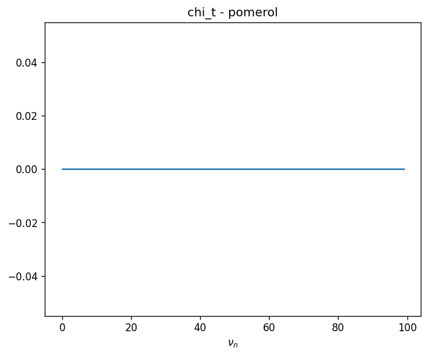

# Dimer — Kanamori interaction + discrete bath

Two-orbital (two-site) impurity with inter-site hopping $t$, a Kanamori
interaction $(U, U', J)$, and a two-level discrete bath:

$$
H_{\mathrm{imp}} = \sum_{ij\sigma} (\epsilon_{ij} - \mu\delta_{ij})
                    c^\dagger_{i\sigma} c_{j\sigma}
  + H_{\mathrm{int}}^{\mathrm{Kanamori}}(U, U', J),
$$

$$
H_{\mathrm{int}}^{\mathrm{Kanamori}} =
  U \sum_i n_{i\uparrow} n_{i\downarrow}
  + U' \sum_{i\neq j} n_{i\uparrow} n_{j\downarrow}
  + (U' - J) \sum_{i<j,\sigma} n_{i\sigma} n_{j\sigma}
  - J \sum_{i\neq j} c^\dagger_{i\uparrow} c_{i\downarrow}
      c^\dagger_{j\downarrow} c_{j\uparrow}
  + J \sum_{i\neq j} c^\dagger_{i\uparrow} c^\dagger_{i\downarrow}
      c_{j\downarrow} c_{j\uparrow}.
$$

Full Hamiltonian (impurity, bath and hybridization) is in `h_tot`.

## Parameters

| Name | Value |
|------|-------|
| `beta` | 5 |
| `n_iw` | 50 |
| `n_w` | 3001 |
| `broadening` | 0.001 |
| `U` | 1 |
| `J` | 0.2 |
| `mu` | 0 |
| `t` | 0.2 |
| `n_orb` | 2 |
| `n_orb_bath` | 2 |
| `block_names` | ['up', 'dn'] |

## Solvers

| solver | name | version | git | TRIQS | MPI | run time (s) |
|--------|------|---------|-----|-------|-----|--------------|
| `alps_cthyb` | alps_cthyb | N/A | `N/A` | 3.3.1 | 1 | 62.7 |
| `atomdiag` | atomdiag | 3.3.1 | `7ffa1ad4` | 3.3.1 | 4 | — |
| `cthyb` | triqs_cthyb | 3.3.0 | `2b720bd7` | 3.3.1 | 4 | 322.3 |
| `ctint` | triqs_ctint | 3.3.0 | `d6d5254c` | 3.3.1 | 4 | 8.4 |
| `edipack` | edipack2triqs | 0.11.0 | `N/A` | 3.3.1 | 4 | 0.2 |
| `pomerol` | pomerol | N/A | `N/A` | 3.3.1 | 4 | — |
| `pyed` | pyed | N/A | `N/A` | 3.3.1 | 4 | — |
| `w2dyn_cthyb` | w2dyn_cthyb | 3.3.0 | `920c648b` | 3.3.1 | 4 | 150.6 |

## $G(i\omega_n)$

### G max-norm deviations

| | alps_cthyb | atomdiag | cthyb | ctint | edipack | pomerol | pyed | w2dyn_cthyb |
|---|---|---|---|---|---|---|---|---|
| **alps_cthyb** | — | 3.00e+00 | 3.01e+00 | 3.00e+00 | 3.00e+00 | 3.00e+00 | 3.00e+00 | 2.99e+00 |
| **atomdiag** |  | — | 2.64e-02 | 1.16e-03 | 1.08e-03 | 2.25e-07 | 7.95e-15 | 1.83e-02 |
| **cthyb** |  |  | — | 2.64e-02 | 2.64e-02 | 2.64e-02 | 2.64e-02 | 2.92e-02 |
| **ctint** |  |  |  | — | 1.22e-03 | 1.16e-03 | 1.16e-03 | 1.83e-02 |
| **edipack** |  |  |  |  | — | 1.08e-03 | 1.08e-03 | 1.83e-02 |
| **pomerol** |  |  |  |  |  | — | 2.25e-07 | 1.83e-02 |
| **pyed** |  |  |  |  |  |  | — | 1.83e-02 |
| **w2dyn_cthyb** |  |  |  |  |  |  |  | — |

## $\Sigma(i\omega_n)$

### Sigma max-norm deviations

| | alps_cthyb | atomdiag | cthyb | ctint | edipack | pomerol | pyed | w2dyn_cthyb |
|---|---|---|---|---|---|---|---|---|
| **alps_cthyb** | — | 6.31e+01 | 2.93e+02 | 6.31e+01 | 6.31e+01 | 6.31e+01 | 6.31e+01 | 1.41e+02 |
| **atomdiag** |  | — | 2.38e+02 | 9.73e-03 | 3.19e-03 | 7.04e-05 | 1.37e-12 | 8.74e+01 |
| **cthyb** |  |  | — | 2.38e+02 | 2.38e+02 | 2.38e+02 | 2.38e+02 | 2.40e+02 |
| **ctint** |  |  |  | — | 9.71e-03 | 9.72e-03 | 9.73e-03 | 8.74e+01 |
| **edipack** |  |  |  |  | — | 3.20e-03 | 3.19e-03 | 8.74e+01 |
| **pomerol** |  |  |  |  |  | — | 7.04e-05 | 8.74e+01 |
| **pyed** |  |  |  |  |  |  | — | 8.74e+01 |
| **w2dyn_cthyb** |  |  |  |  |  |  |  | — |

## Static observables

### density

| solver | dn_0 | dn_1 | up_0 | up_1 |
|---|---|---|---|---|
| atomdiag | 0.251558 | 0.232391 | 0.251558 | 0.232391 |
| cthyb | 0.251823 | 0.232620 | 0.251253 | 0.232700 |
| ctint | 0.252082 | 0.232646 | 0.252152 | 0.232342 |
| edipack | 0.249956 | 0.230799 | 0.249956 | 0.230799 |
| pomerol |  |  |  |  |
| pyed | 0.251558 | 0.232391 | 0.251558 | 0.232391 |

### nn_ab

| solver | dn_0,dn_0 | dn_0,dn_1 | dn_0,up_0 | dn_0,up_1 | dn_1,dn_0 | dn_1,dn_1 | dn_1,up_0 | dn_1,up_1 | up_0,dn_0 | up_0,dn_1 | up_0,up_0 | up_0,up_1 | up_1,dn_0 | up_1,dn_1 | up_1,up_0 | up_1,up_1 |
|---|---|---|---|---|---|---|---|---|---|---|---|---|---|---|---|---|
| atomdiag | 0.251558 | 0.013270 | 0.053819 | 0.057110 | 0.013270 | 0.232391 | 0.057110 | 0.045753 | 0.053819 | 0.057110 | 0.251558 | 0.013270 | 0.057110 | 0.045753 | 0.013270 | 0.232391 |
| cthyb | 0.251823 | 0.013169 | 0.053624 | 0.057113 | 0.013169 | 0.232620 | 0.057189 | 0.045692 | 0.053624 | 0.057189 | 0.251253 | 0.012999 | 0.057113 | 0.045692 | 0.012999 | 0.232700 |
| edipack | 0.249956 |  | 0.053131 |  |  | 0.230799 |  | 0.045118 | 0.053131 |  | 0.249956 |  |  | 0.045118 |  | 0.230799 |
| pomerol |  |  |  |  |  |  |  |  |  |  |  |  |  |  |  |  |
| pyed | 0.251558 | 0.013270 | 0.053819 | 0.057110 | 0.013270 | 0.232391 | 0.057110 | 0.045753 | 0.053819 | 0.057110 | 0.251558 | 0.013270 | 0.057110 | 0.045753 | 0.013270 | 0.232391 |

## Spectral function $A(\omega) = -\tfrac{1}{\pi} \mathrm{Im}\, G^R(\omega)$

### G(w) max-norm deviations

| | atomdiag | edipack |
|---|---|---|
| **atomdiag** | — | 1.06e+00 |
| **edipack** |  | — |

## Two-point susceptibilities $\chi_2$
### chi2_d

### chi2_d max-norm deviations

| | edipack | pomerol |
|---|---|---|
| **edipack** | — | 1.13e-02 |
| **pomerol** |  | — |

### chi2_m

### chi2_m max-norm deviations

| | edipack | pomerol |
|---|---|---|
| **edipack** | — | 5.29e-04 |
| **pomerol** |  | — |

### chi2_s

### chi2_s max-norm deviations

| | edipack | pomerol |
|---|---|---|
| **edipack** | — | 3.89e-01 |
| **pomerol** |  | — |

### chi2_t

### chi2_t max-norm deviations

| | edipack | pomerol |
|---|---|---|
| **edipack** | — | 0.00e+00 |
| **pomerol** |  | — |

## Three-point correlators $\chi_3$
### chi3_d

_Need at least 2 solvers for deviation table (have 1)._

### chi3_m

_Need at least 2 solvers for deviation table (have 1)._

### chi3_s

_Need at least 2 solvers for deviation table (have 1)._

### chi3_t

_Need at least 2 solvers for deviation table (have 1)._

