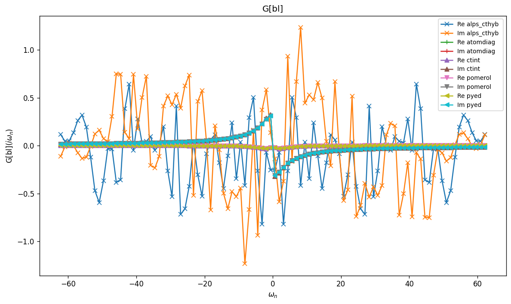
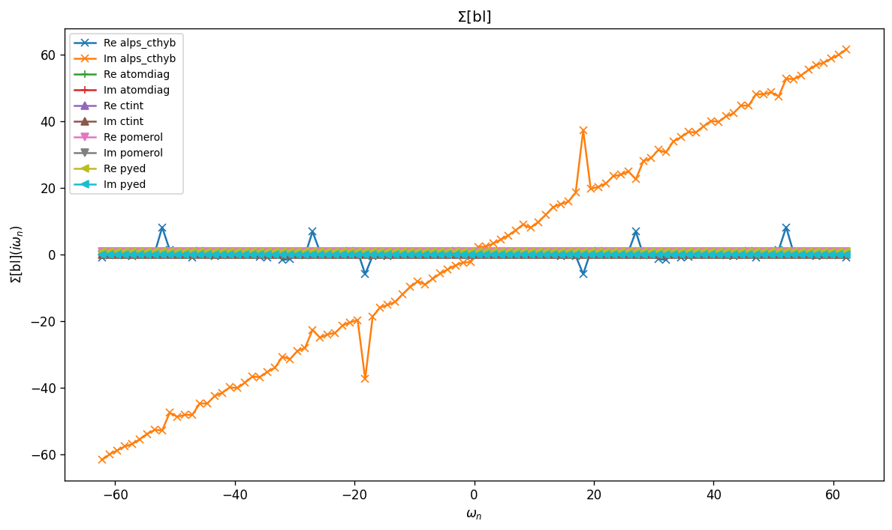
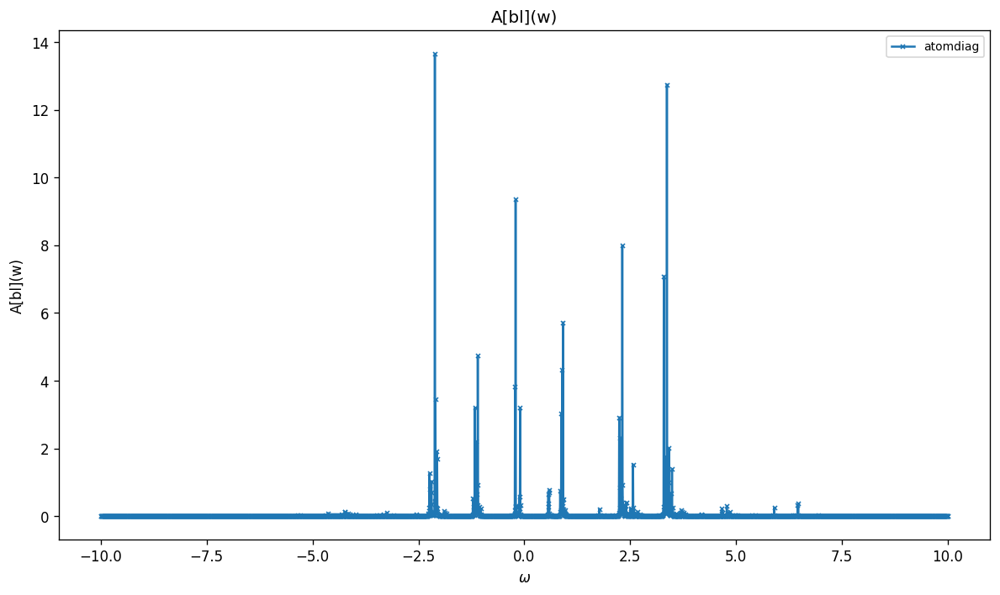

# Dimer with Spin–Orbit Coupling

Two-site dimer with an on-site spin–orbit coupling term $a$ mixing spin and
orbital indices. Because spin is no longer a good quantum number, all four
spin–orbital flavours $(\uparrow_0, \uparrow_1, \downarrow_0, \downarrow_1)$
are placed in a single block labelled `'bl'`.

The single-particle Hamiltonian couples the two sites via the hopping $t$ and
the SOC $a$:

$$
h_0 = \mathrm{diag}(\epsilon_i - \mu)
   - \begin{pmatrix} 0 & t+a & 0 & a \\\ t-a & 0 & -a & 0 \\\
                     0 & a & 0 & t+a \\\ -a & 0 & t-a & 0 \end{pmatrix},
$$

and the interaction is restricted to density–density terms
$U\, n_{i\uparrow} n_{i\downarrow}$ plus $U'\, n_{i\sigma} n_{j\sigma}$.

## Parameters

| Name | Value |
|------|-------|
| `beta` | 5 |
| `n_iw` | 50 |
| `n_w` | 3001 |
| `broadening` | 0.001 |
| `U` | 1 |
| `mu` | 0.25 |
| `t` | 1 |
| `n_orb` | 4 |
| `n_orb_bath` | 4 |
| `block_names` | ['bl'] |

## Solvers

| solver | name | version | git | TRIQS | MPI | run time (s) |
|--------|------|---------|-----|-------|-----|--------------|
| `alps_cthyb` | alps_cthyb | N/A | `N/A` | 3.3.1 | 1 | 62.6 |
| `atomdiag` | atomdiag | 3.3.1 | `7ffa1ad4` | 3.3.1 | 4 | — |
| `ctint` | triqs_ctint | 3.3.0 | `d6d5254c` | 3.3.1 | 4 | 4.5 |
| `pomerol` | pomerol | N/A | `N/A` | 3.3.1 | 4 | — |
| `pyed` | pyed | N/A | `N/A` | 3.3.1 | 4 | — |

## $G(i\omega_n)$

### G max-norm deviations

| | alps_cthyb | atomdiag | ctint | pomerol | pyed |
|---|---|---|---|---|---|
| **alps_cthyb** | — | 2.05e+00 | 2.05e+00 | 2.05e+00 | 2.05e+00 |
| **atomdiag** |  | — | 1.64e-02 | 6.08e-07 | 2.42e-14 |
| **ctint** |  |  | — | 1.64e-02 | 1.64e-02 |
| **pomerol** |  |  |  | — | 6.08e-07 |
| **pyed** |  |  |  |  | — |

## $\Sigma(i\omega_n)$

### Sigma max-norm deviations

| | alps_cthyb | atomdiag | ctint | pomerol | pyed |
|---|---|---|---|---|---|
| **alps_cthyb** | — | 6.32e+01 | 6.32e+01 | 6.32e+01 | 6.32e+01 |
| **atomdiag** |  | — | 2.13e-01 | 1.97e-04 | 3.74e-12 |
| **ctint** |  |  | — | 2.13e-01 | 2.13e-01 |
| **pomerol** |  |  |  | — | 1.97e-04 |
| **pyed** |  |  |  |  | — |

## Static observables

### density

| solver | bl_0 | bl_1 | bl_2 | bl_3 |
|---|---|---|---|---|
| atomdiag |  |  |  |  |
| ctint | 0.421636 | 0.395356 | 0.421355 | 0.395075 |
| pomerol |  |  |  |  |
| pyed |  |  |  |  |

### nn_ab

| solver | bl_0,bl_0 | bl_0,bl_1 | bl_0,bl_2 | bl_0,bl_3 | bl_1,bl_0 | bl_1,bl_1 | bl_1,bl_2 | bl_1,bl_3 | bl_2,bl_0 | bl_2,bl_1 | bl_2,bl_2 | bl_2,bl_3 | bl_3,bl_0 | bl_3,bl_1 | bl_3,bl_2 | bl_3,bl_3 |
|---|---|---|---|---|---|---|---|---|---|---|---|---|---|---|---|---|
| atomdiag |  |  |  |  |  |  |  |  |  |  |  |  |  |  |  |  |
| pomerol |  |  |  |  |  |  |  |  |  |  |  |  |  |  |  |  |
| pyed |  |  |  |  |  |  |  |  |  |  |  |  |  |  |  |  |

## Spectral function $A(\omega) = -\tfrac{1}{\pi} \mathrm{Im}\, G^R(\omega)$

_Need at least 2 solvers for deviation table (have 1)._

