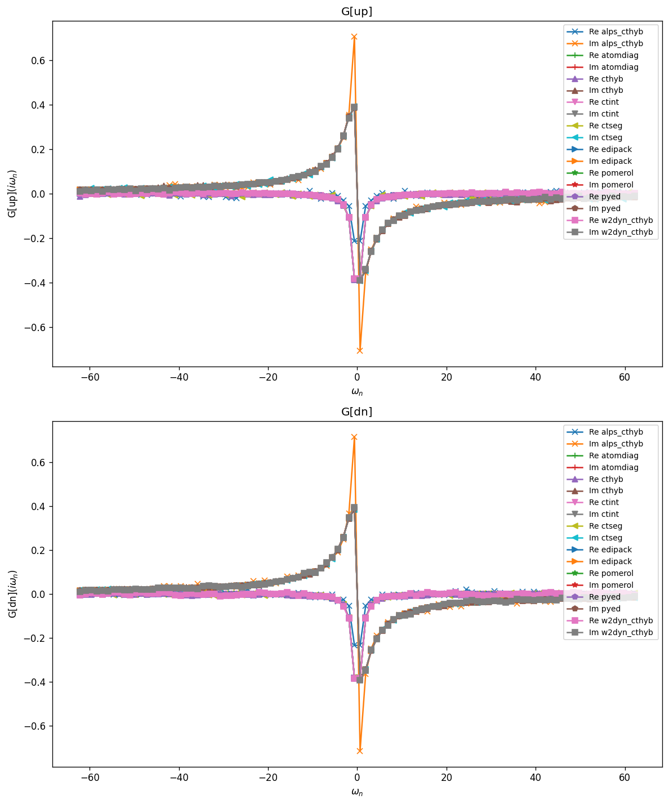
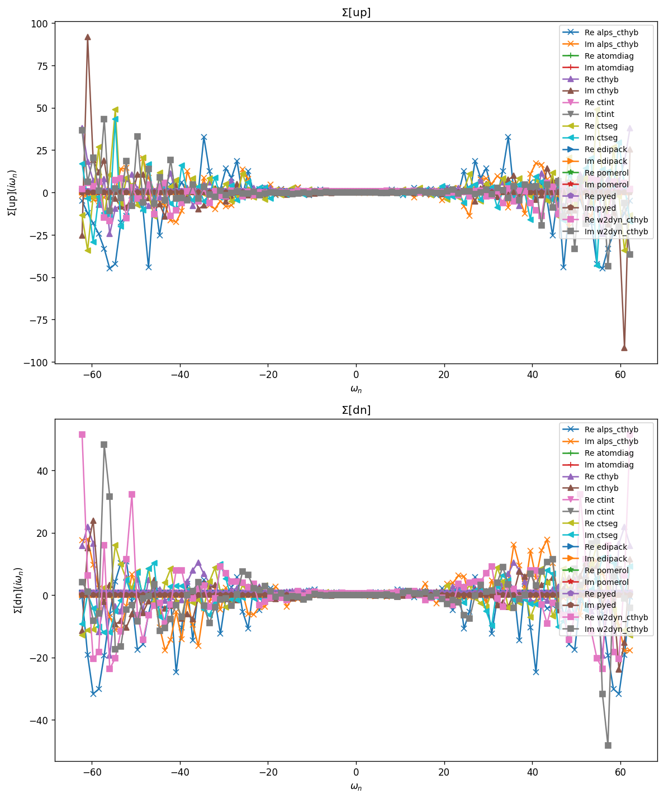
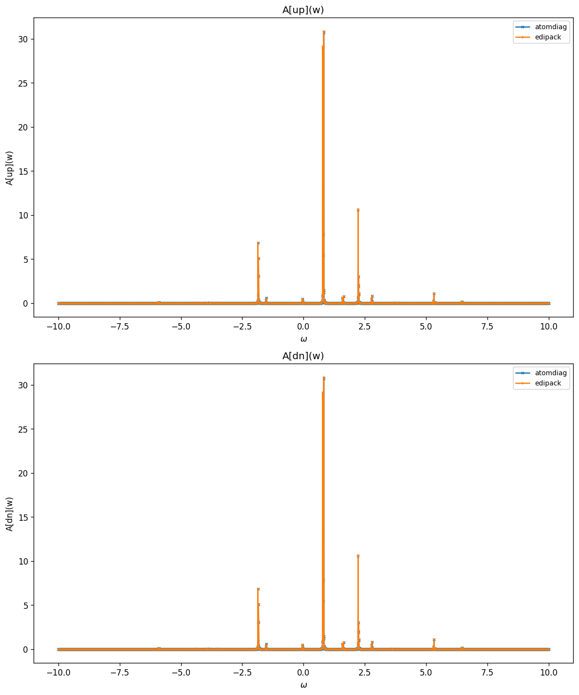
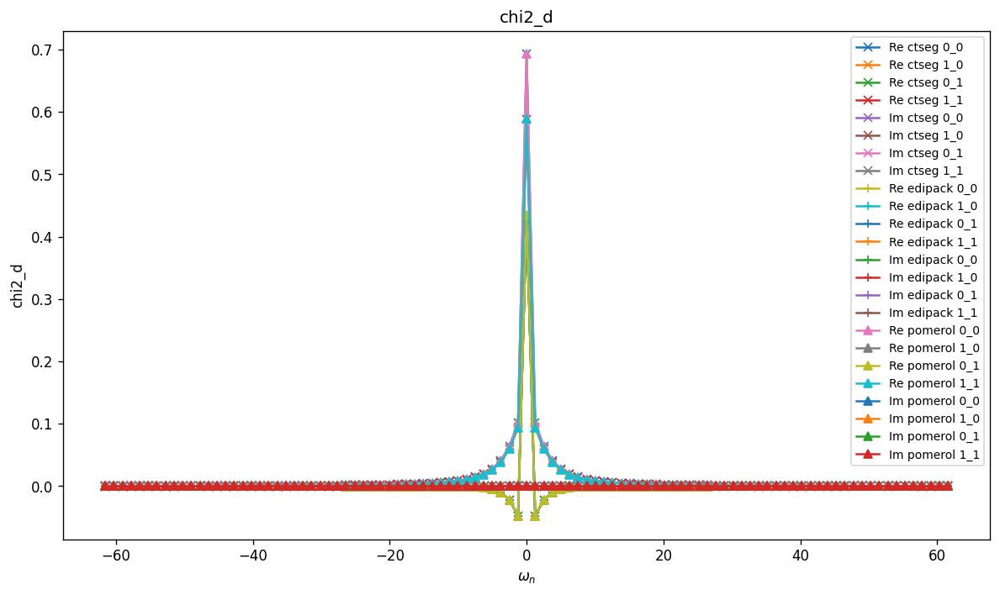
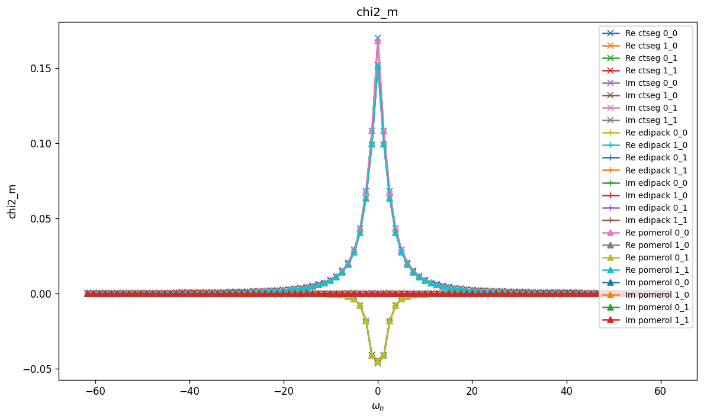
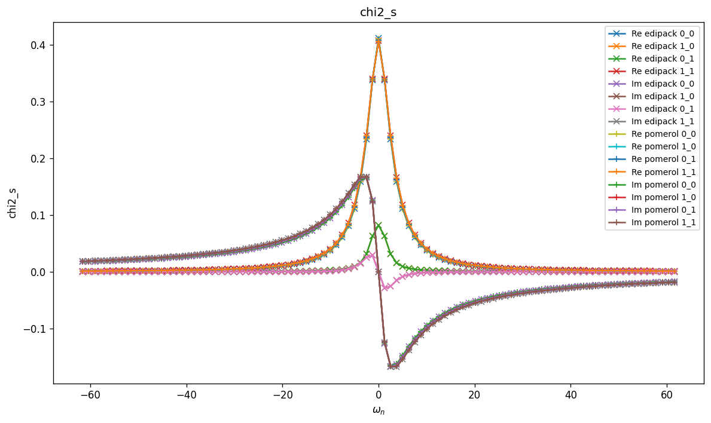
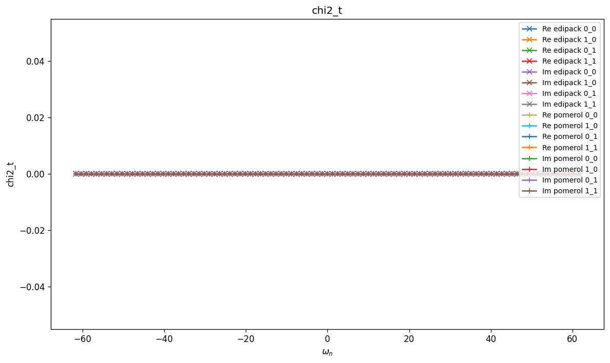
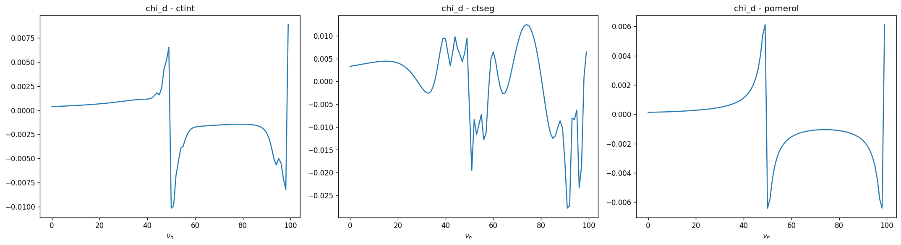
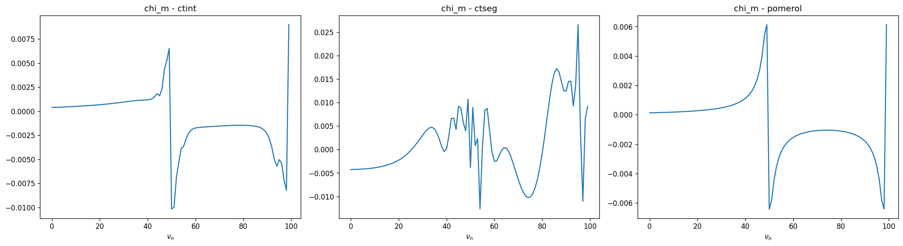
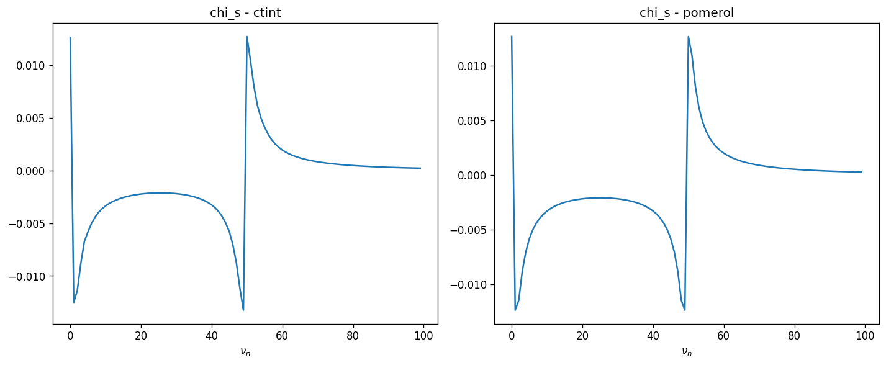

# Dimer — Density–Density Interaction

Same two-orbital impurity geometry as `Dimer` (inter-site hopping $t$ and a
two-level discrete bath), but with the interaction reduced to the
density–density terms only (no pair-hopping, no spin-flip):

$$
H_{\mathrm{int}}^{nn} =
  U \sum_i n_{i\uparrow} n_{i\downarrow}
  + U' \sum_{i\neq j} n_{i\uparrow} n_{j\downarrow}
  + (U' - J) \sum_{i<j,\sigma} n_{i\sigma} n_{j\sigma}.
$$

Density–density restriction is useful for `ctseg`, which requires the
interaction to commute with $n_\sigma(\tau)$.

## Parameters

| Name | Value |
|------|-------|
| `beta` | 5 |
| `n_iw` | 50 |
| `n_w` | 3001 |
| `broadening` | 0.001 |
| `U` | 1 |
| `J` | 0 |
| `mu` | 0 |
| `t` | 0 |
| `n_orb` | 2 |
| `n_orb_bath` | 2 |
| `block_names` | ['up', 'dn'] |

## Solvers

| solver | name | version | git | TRIQS | MPI | run time (s) |
|--------|------|---------|-----|-------|-----|--------------|
| `alps_cthyb` | alps_cthyb | N/A | `N/A` | 3.3.1 | 1 | 63.4 |
| `atomdiag` | atomdiag | 3.3.1 | `7ffa1ad4` | 3.3.1 | 4 | — |
| `cthyb` | triqs_cthyb | 3.3.0 | `2b720bd7` | 3.3.1 | 4 | 174.9 |
| `ctint` | triqs_ctint | 3.3.0 | `d6d5254c` | 3.3.1 | 4 | 336.7 |
| `ctseg` | triqs_ctseg | 3.3.0 | `b8f1388b` | 3.3.1 | 4 | 235.6 |
| `edipack` | edipack2triqs | 0.11.0 | `N/A` | 3.3.1 | 4 | 0.2 |
| `pomerol` | pomerol | N/A | `N/A` | 3.3.1 | 4 | — |
| `pyed` | pyed | N/A | `N/A` | 3.3.1 | 4 | — |
| `w2dyn_cthyb` | w2dyn_cthyb | 3.3.0 | `920c648b` | 3.3.1 | 4 | 137.2 |

## $G(i\omega_n)$

### G max-norm deviations

| | alps_cthyb | atomdiag | cthyb | ctint | ctseg | edipack | pomerol | pyed | w2dyn_cthyb |
|---|---|---|---|---|---|---|---|---|---|
| **alps_cthyb** | — | 4.00e-01 | 4.00e-01 | 4.00e-01 | 3.95e-01 | 4.00e-01 | 4.00e-01 | 4.00e-01 | 3.97e-01 |
| **atomdiag** |  | — | 1.34e-02 | 4.39e-04 | 1.60e-02 | 4.66e-04 | 1.68e-07 | 7.36e-15 | 1.37e-02 |
| **cthyb** |  |  | — | 1.34e-02 | 1.93e-02 | 1.34e-02 | 1.34e-02 | 1.34e-02 | 1.92e-02 |
| **ctint** |  |  |  | — | 1.60e-02 | 8.36e-04 | 4.39e-04 | 4.39e-04 | 1.37e-02 |
| **ctseg** |  |  |  |  | — | 1.60e-02 | 1.60e-02 | 1.60e-02 | 2.06e-02 |
| **edipack** |  |  |  |  |  | — | 4.66e-04 | 4.66e-04 | 1.37e-02 |
| **pomerol** |  |  |  |  |  |  | — | 1.68e-07 | 1.37e-02 |
| **pyed** |  |  |  |  |  |  |  | — | 1.37e-02 |
| **w2dyn_cthyb** |  |  |  |  |  |  |  |  | — |

## $\Sigma(i\omega_n)$

### Sigma max-norm deviations

| | alps_cthyb | atomdiag | cthyb | ctint | ctseg | edipack | pomerol | pyed | w2dyn_cthyb |
|---|---|---|---|---|---|---|---|---|---|
| **alps_cthyb** | — | 8.48e+01 | 9.91e+01 | 8.48e+01 | 1.03e+02 | 8.48e+01 | 8.48e+01 | 8.48e+01 | 1.05e+02 |
| **atomdiag** |  | — | 9.35e+01 | 1.38e-02 | 6.48e+01 | 2.48e-03 | 5.51e-05 | 1.45e-12 | 9.26e+01 |
| **cthyb** |  |  | — | 9.35e+01 | 1.09e+02 | 9.35e+01 | 9.35e+01 | 9.35e+01 | 8.65e+01 |
| **ctint** |  |  |  | — | 6.48e+01 | 1.41e-02 | 1.38e-02 | 1.38e-02 | 9.26e+01 |
| **ctseg** |  |  |  |  | — | 6.48e+01 | 6.48e+01 | 6.48e+01 | 9.52e+01 |
| **edipack** |  |  |  |  |  | — | 2.48e-03 | 2.48e-03 | 9.26e+01 |
| **pomerol** |  |  |  |  |  |  | — | 5.51e-05 | 9.26e+01 |
| **pyed** |  |  |  |  |  |  |  | — | 9.26e+01 |
| **w2dyn_cthyb** |  |  |  |  |  |  |  |  | — |

## Static observables

### density

| solver | dn_0 | dn_1 | up_0 | up_1 |
|---|---|---|---|---|
| atomdiag | 0.233189 | 0.212701 | 0.233189 | 0.212701 |
| cthyb | 0.233617 | 0.211985 | 0.233285 | 0.212895 |
| ctint | 0.233155 | 0.212866 | 0.233608 | 0.213132 |
| ctseg | 0.233206 | 0.212453 | 0.233165 | 0.212613 |
| edipack | 0.232364 | 0.211893 | 0.232364 | 0.211893 |
| pomerol |  |  |  |  |
| pyed | 0.233189 | 0.212701 | 0.233189 | 0.212701 |

### nn_ab

| solver | dn_0,dn_0 | dn_0,dn_1 | dn_0,up_0 | dn_0,up_1 | dn_1,dn_0 | dn_1,dn_1 | dn_1,up_0 | dn_1,up_1 | up_0,dn_0 | up_0,dn_1 | up_0,up_0 | up_0,up_1 | up_1,dn_0 | up_1,dn_1 | up_1,up_0 | up_1,up_1 |
|---|---|---|---|---|---|---|---|---|---|---|---|---|---|---|---|---|
| atomdiag | 0.233189 | 0.005613 | 0.049192 | 0.044994 | 0.005613 | 0.212701 | 0.044994 | 0.041146 | 0.049192 | 0.044994 | 0.233189 | 0.005613 | 0.044994 | 0.041146 | 0.005613 | 0.212701 |
| cthyb | 0.233617 | 0.005644 | 0.049340 | 0.045087 | 0.005644 | 0.211985 | 0.044701 | 0.041191 | 0.049340 | 0.044701 | 0.233285 | 0.005582 | 0.045087 | 0.041191 | 0.005582 | 0.212895 |
| edipack | 0.232364 |  | 0.048871 |  |  | 0.211893 |  | 0.040858 | 0.048871 |  | 0.232364 |  |  | 0.040858 |  | 0.211893 |
| pomerol |  |  |  |  |  |  |  |  |  |  |  |  |  |  |  |  |
| pyed | 0.233189 | 0.005613 | 0.049192 | 0.044994 | 0.005613 | 0.212701 | 0.044994 | 0.041146 | 0.049192 | 0.044994 | 0.233189 | 0.005613 | 0.044994 | 0.041146 | 0.005613 | 0.212701 |

## Spectral function $A(\omega) = -\tfrac{1}{\pi} \mathrm{Im}\, G^R(\omega)$

### G(w) max-norm deviations

| | atomdiag | edipack |
|---|---|---|
| **atomdiag** | — | 5.36e-01 |
| **edipack** |  | — |

## Two-point susceptibilities $\chi_2$
### chi2_d

### chi2_d max-norm deviations

| | ctseg | edipack | pomerol |
|---|---|---|---|
| **ctseg** | — | 5.87e-03 | 1.22e-03 |
| **edipack** |  | — | 5.53e-03 |
| **pomerol** |  |  | — |

### chi2_m

### chi2_m max-norm deviations

| | ctseg | edipack | pomerol |
|---|---|---|---|
| **ctseg** | — | 1.96e-03 | 1.93e-03 |
| **edipack** |  | — | 2.61e-04 |
| **pomerol** |  |  | — |

### chi2_s

### chi2_s max-norm deviations

| | edipack | pomerol |
|---|---|---|
| **edipack** | — | 3.26e-01 |
| **pomerol** |  | — |

### chi2_t

### chi2_t max-norm deviations

| | edipack | pomerol |
|---|---|---|
| **edipack** | — | 0.00e+00 |
| **pomerol** |  | — |

## Three-point correlators $\chi_3$
### chi3_d

### chi3_d max-norm deviations

| | ctint | ctseg | pomerol |
|---|---|---|---|
| **ctint** | — | 5.54e+00 | 1.83e-01 |
| **ctseg** |  | — | 5.47e+00 |
| **pomerol** |  |  | — |

### chi3_m

### chi3_m max-norm deviations

| | ctint | ctseg | pomerol |
|---|---|---|---|
| **ctint** | — | 2.90e-01 | 1.83e-01 |
| **ctseg** |  | — | 2.41e-01 |
| **pomerol** |  |  | — |

### chi3_s

### chi3_s max-norm deviations

| | ctint | pomerol |
|---|---|---|
| **ctint** | — | 2.23e-02 |
| **pomerol** |  | — |

### chi3_t

### chi3_t max-norm deviations

| | ctint | pomerol |
|---|---|---|
| **ctint** | — | 1.59e-02 |
| **pomerol** |  | — |

