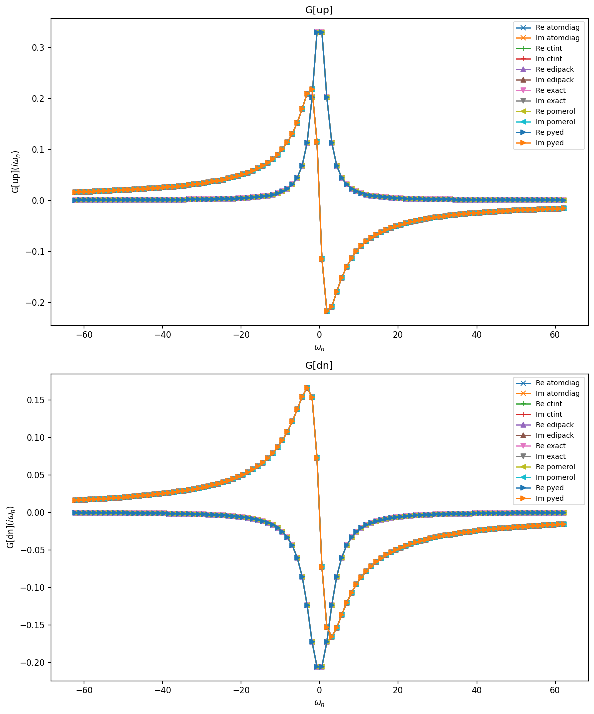
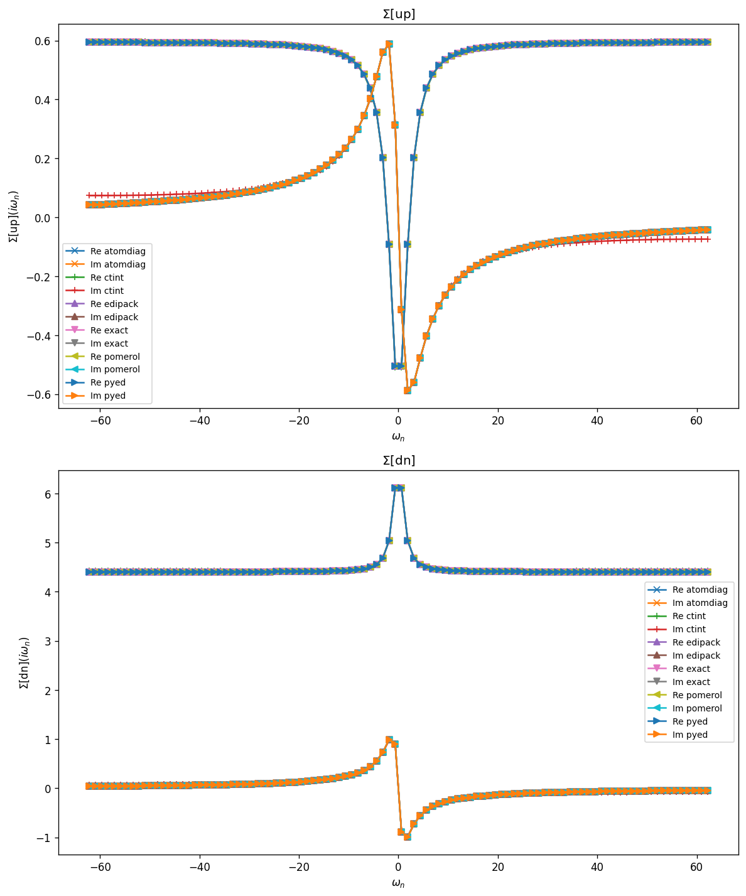
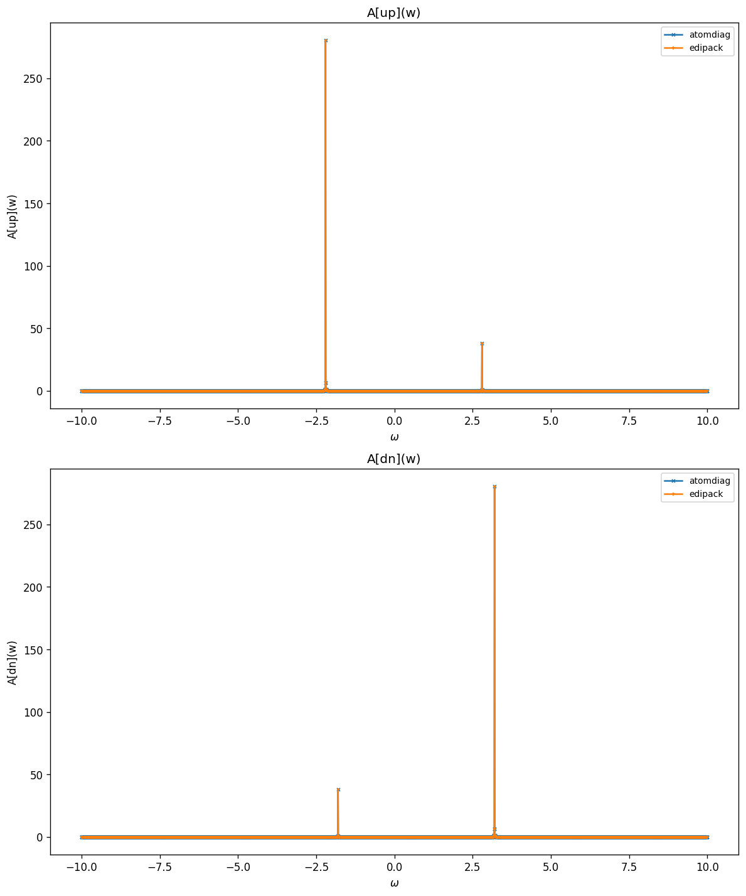
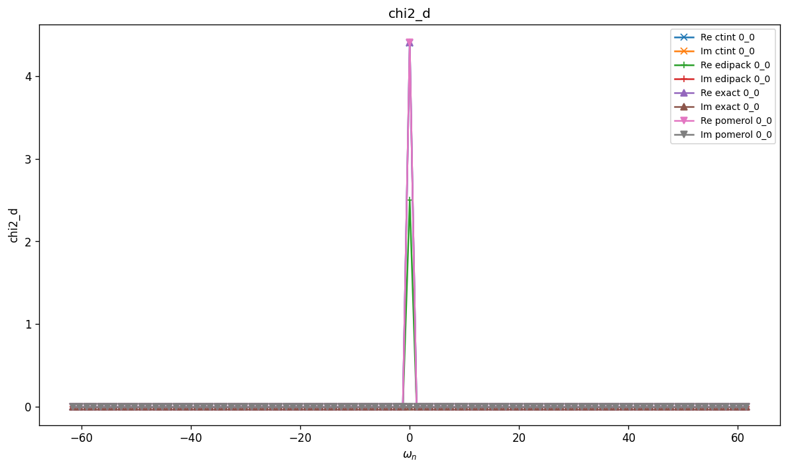
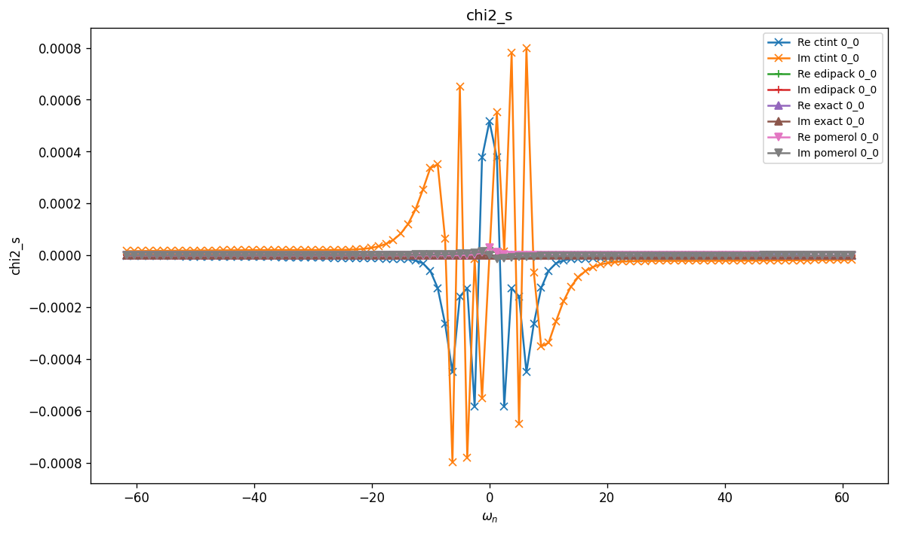
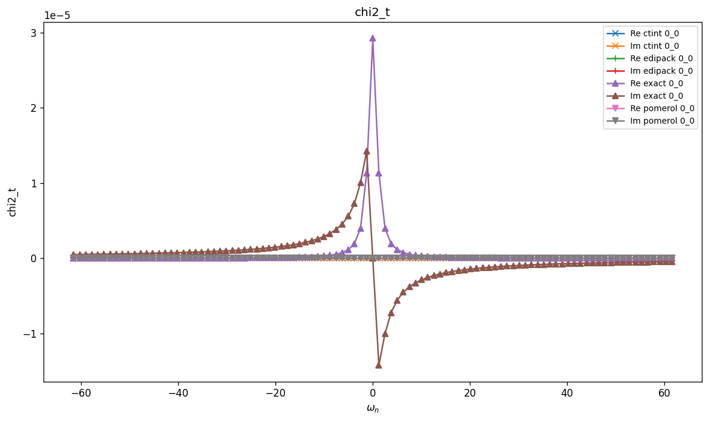
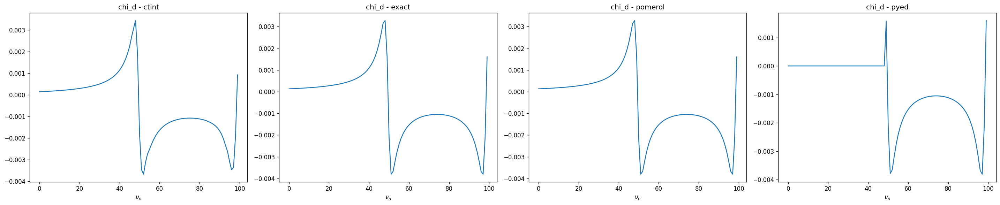
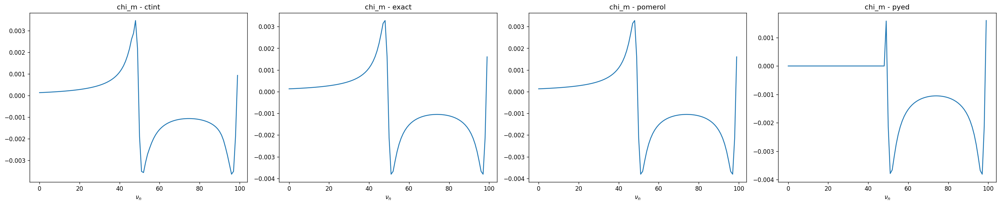
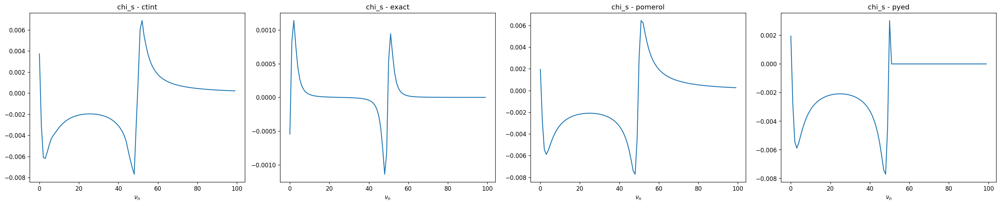
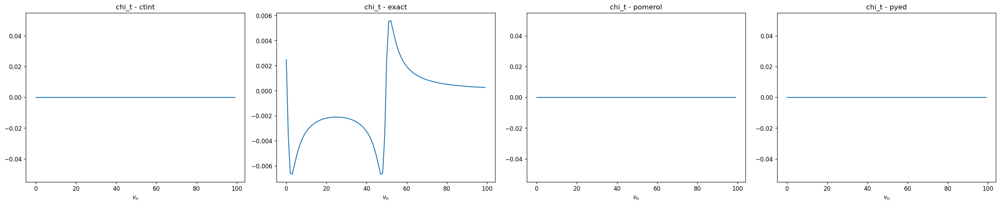

# Hubbard Atom

A single atomic level with on-site Coulomb repulsion $U$, chemical potential $\mu$,
and local magnetic (Zeeman) field $h$. No bath — the impurity is isolated, so the
Green function of the atom can be written down analytically.

$$
H = -\mu\,(n_\uparrow + n_\downarrow)
    - h\,(n_\uparrow - n_\downarrow)
    + U\, n_\uparrow n_\downarrow
$$

## Parameters

| Name | Value |
|------|-------|
| `beta` | 5 |
| `n_iw` | 50 |
| `n_w` | 3001 |
| `broadening` | 0.001 |
| `U` | 5 |
| `mu` | 2 |
| `h` | 0.2 |
| `n_orb` | 1 |
| `n_orb_bath` | 0 |
| `block_names` | ['up', 'dn'] |

## Solvers

| solver | name | version | git | TRIQS | MPI | run time (s) |
|--------|------|---------|-----|-------|-----|--------------|
| `atomdiag` | atomdiag | 3.3.1 | `7ffa1ad4` | 3.3.1 | 4 | — |
| `ctint` | triqs_ctint | 3.3.0 | `d6d5254c` | 3.3.1 | 4 | 171.3 |
| `edipack` | edipack2triqs | 0.11.0 | `N/A` | 3.3.1 | 4 | 0.0 |
| `exact` | exact | N/A | `N/A` | 3.3.1 | 4 | — |
| `pomerol` | pomerol | N/A | `N/A` | 3.3.1 | 4 | — |
| `pyed` | pyed | N/A | `N/A` | 3.3.1 | 4 | — |

## $G(i\omega_n)$

### G max-norm deviations

| | atomdiag | ctint | edipack | exact | pomerol | pyed |
|---|---|---|---|---|---|---|
| **atomdiag** | — | 8.45e-04 | 6.21e-17 | 2.22e-16 | 0.00e+00 | 6.94e-17 |
| **ctint** |  | — | 8.45e-04 | 8.45e-04 | 8.45e-04 | 8.45e-04 |
| **edipack** |  |  | — | 2.22e-16 | 6.21e-17 | 6.21e-17 |
| **exact** |  |  |  | — | 2.22e-16 | 1.96e-16 |
| **pomerol** |  |  |  |  | — | 6.94e-17 |
| **pyed** |  |  |  |  |  | — |

## $\Sigma(i\omega_n)$

### Sigma max-norm deviations

| | atomdiag | ctint | edipack | exact | pomerol | pyed |
|---|---|---|---|---|---|---|
| **atomdiag** | — | 3.80e-02 | 2.85e-14 | 1.42e-14 | 0.00e+00 | 1.43e-14 |
| **ctint** |  | — | 3.80e-02 | 3.80e-02 | 3.80e-02 | 3.80e-02 |
| **edipack** |  |  | — | 1.43e-14 | 2.85e-14 | 1.42e-14 |
| **exact** |  |  |  | — | 1.42e-14 | 1.43e-14 |
| **pomerol** |  |  |  |  | — | 1.43e-14 |
| **pyed** |  |  |  |  |  | — |

## Static observables

### density

| solver | dn | up |
|---|---|---|
| atomdiag | 0.119201 | 0.880784 |
| ctint | 0.118571 | 0.880837 |
| edipack | 0.119201 | 0.880784 |
| exact | 0.119201 | 0.880784 |
| pomerol |  |  |
| pyed | 0.119201 | 0.880784 |

### nn_ab

| solver | dn,dn | dn,up | up,dn | up,up |
|---|---|---|---|---|
| atomdiag | 0.119201 | 0.000000 | 0.000000 | 0.880784 |
| edipack | 0.119201 | 0.000000 | 0.000000 | 0.880784 |
| exact | 0.119201 | 0.000000 | 0.000000 | 0.880784 |
| pomerol |  |  |  |  |
| pyed | 0.119201 | 0.000000 | 0.000000 | 0.880784 |

## Spectral function $A(\omega) = -\tfrac{1}{\pi} \mathrm{Im}\, G^R(\omega)$

### G(w) max-norm deviations

| | atomdiag | edipack |
|---|---|---|
| **atomdiag** | — | 5.29e-11 |
| **edipack** |  | — |

## Two-point susceptibilities $\chi_2$
### chi2_d

### chi2_d max-norm deviations

| | ctint | edipack | exact | pomerol |
|---|---|---|---|---|
| **ctint** | — | 1.90e+00 | 2.80e-03 | 2.80e-03 |
| **edipack** |  | — | 1.90e+00 | 1.90e+00 |
| **exact** |  |  | — | 8.88e-16 |
| **pomerol** |  |  |  | — |

### chi2_m

### chi2_m max-norm deviations

| | ctint | edipack | exact | pomerol |
|---|---|---|---|---|
| **ctint** | — | 1.91e+00 | 3.33e-03 | 3.33e-03 |
| **edipack** |  | — | 1.90e+00 | 1.90e+00 |
| **exact** |  |  | — | 8.88e-16 |
| **pomerol** |  |  |  | — |

### chi2_s

### chi2_s max-norm deviations

| | ctint | edipack | exact | pomerol |
|---|---|---|---|---|
| **ctint** | — | 9.20e-04 | 9.16e-04 | 9.20e-04 |
| **edipack** |  | — | 2.92e-05 | 0.00e+00 |
| **exact** |  |  | — | 2.92e-05 |
| **pomerol** |  |  |  | — |

### chi2_t

### chi2_t max-norm deviations

| | ctint | edipack | exact | pomerol |
|---|---|---|---|---|
| **ctint** | — | 0.00e+00 | 2.92e-05 | 0.00e+00 |
| **edipack** |  | — | 2.92e-05 | 0.00e+00 |
| **exact** |  |  | — | 2.92e-05 |
| **pomerol** |  |  |  | — |

## Three-point correlators $\chi_3$
### chi3_d

### chi3_d max-norm deviations

| | ctint | exact | pomerol | pyed |
|---|---|---|---|---|
| **ctint** | — | 3.54e-02 | 3.54e-02 | 4.27e-02 |
| **exact** |  | — | 6.66e-16 | 1.24e-02 |
| **pomerol** |  |  | — | 1.24e-02 |
| **pyed** |  |  |  | — |

### chi3_m

### chi3_m max-norm deviations

| | ctint | exact | pomerol | pyed |
|---|---|---|---|---|
| **ctint** | — | 1.74e-01 | 1.74e-01 | 1.70e-01 |
| **exact** |  | — | 4.00e-16 | 9.46e-03 |
| **pomerol** |  |  | — | 9.46e-03 |
| **pyed** |  |  |  | — |

### chi3_s

### chi3_s max-norm deviations

| | ctint | exact | pomerol | pyed |
|---|---|---|---|---|
| **ctint** | — | 2.80e-01 | 1.37e-02 | 1.37e-02 |
| **exact** |  | — | 2.80e-01 | 2.80e-01 |
| **pomerol** |  |  | — | 9.25e-03 |
| **pyed** |  |  |  | — |

### chi3_t

### chi3_t max-norm deviations

| | ctint | exact | pomerol | pyed |
|---|---|---|---|---|
| **ctint** | — | 2.80e-01 | 0.00e+00 | 0.00e+00 |
| **exact** |  | — | 2.80e-01 | 2.80e-01 |
| **pomerol** |  |  | — | 0.00e+00 |
| **pyed** |  |  |  | — |

