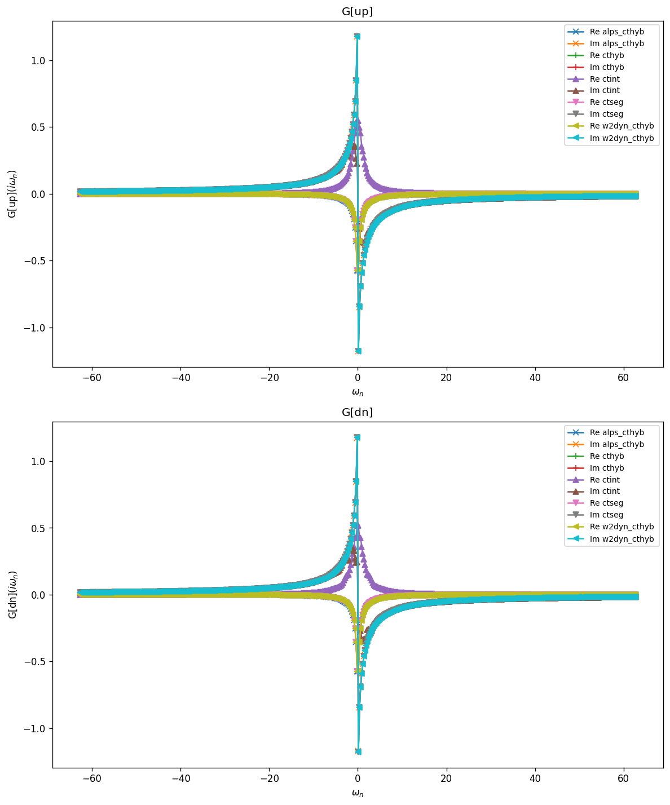
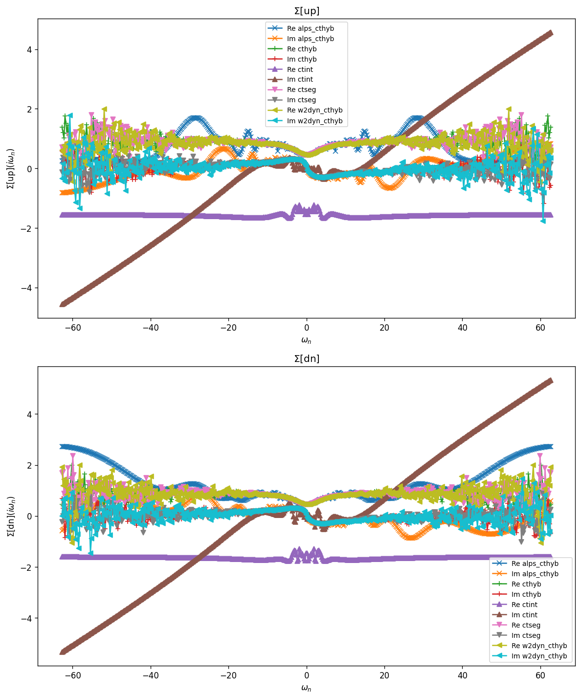
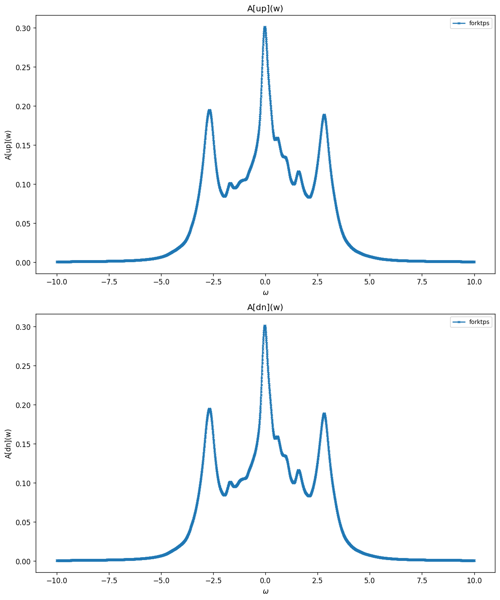
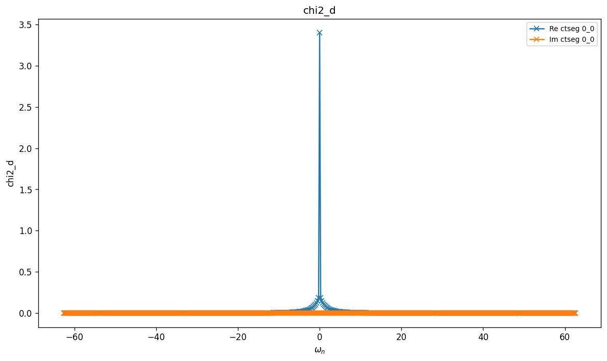
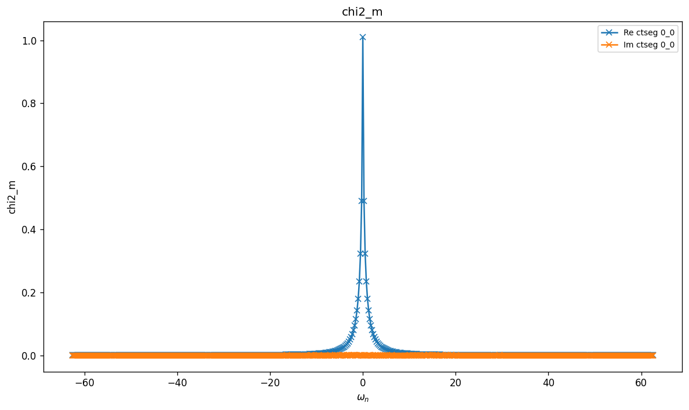
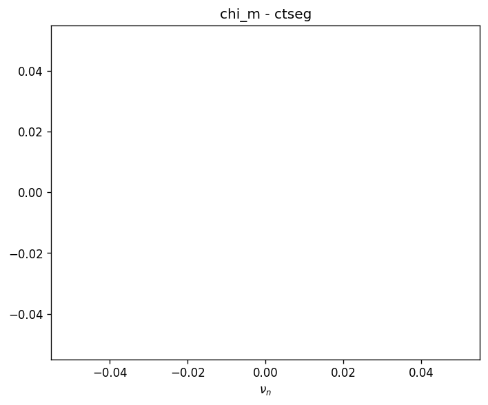

# La$_2$CuO$_4$ — Single-band DMFT impurity

Single-band effective model for the parent cuprate La$_2$CuO$_4$, obtained from
a Wannier90 Hamiltonian for the Cu $d_{x^2-y^2}$ orbital. The lattice is
reduced to a DMFT impurity problem: an on-site Hubbard interaction $U$ together
with a hybridization function generated by summing the non-interacting lattice
Green function over the Brillouin zone.

$$
\Delta(i\omega_n) = i\omega_n + \mu - h_0
  - \left[\frac{1}{N_k} \sum_\mathbf{k}
    \bigl(i\omega_n + \mu - H(\mathbf{k})\bigr)^{-1}\right]^{-1}.
$$

## Parameters

| Name | Value |
|------|-------|
| `beta` | 25 |
| `n_iw` | 250 |
| `n_w` | 3001 |
| `broadening` | 0.001 |
| `U` | 3.6 |
| `mu` | 12.79 |
| `n_orb` | 1 |
| `block_names` | ['up', 'dn'] |

## Solvers

| solver | name | version | git | TRIQS | MPI | run time (s) |
|--------|------|---------|-----|-------|-----|--------------|
| `alps_cthyb` | alps_cthyb | N/A | `N/A` | 3.3.1 | 1 | 64.4 |
| `cthyb` | triqs_cthyb | 3.3.0 | `2b720bd7` | 3.3.1 | 16 | 629.6 |
| `ctint` | triqs_ctint | 3.3.0 | `d6d5254c` | 3.3.1 | 16 | 354.2 |
| `ctseg` | triqs_ctseg | 3.3.0 | `b8f1388b` | 3.3.1 | 16 | 668.2 |
| `forktps` | forktps | 3.3.0 | `02e155dc` | 3.3.1 | 16 | 90.3 |
| `w2dyn_cthyb` | w2dyn_cthyb | 3.3.0 | `920c648b` | 3.3.1 | 16 | 56.8 |

## $G(i\omega_n)$

### G max-norm deviations

| | alps_cthyb | cthyb | ctint | ctseg | w2dyn_cthyb |
|---|---|---|---|---|---|
| **alps_cthyb** | — | 5.03e-03 | 1.47e+00 | 5.21e-03 | 5.72e-03 |
| **cthyb** |  | — | 1.47e+00 | 5.71e-04 | 9.48e-04 |
| **ctint** |  |  | — | 1.47e+00 | 1.47e+00 |
| **ctseg** |  |  |  | — | 9.12e-04 |
| **w2dyn_cthyb** |  |  |  |  | — |

## $\Sigma(i\omega_n)$

### Sigma max-norm deviations

| | alps_cthyb | cthyb | ctint | ctseg | w2dyn_cthyb |
|---|---|---|---|---|---|
| **alps_cthyb** | — | 2.61e+00 | 6.46e+00 | 2.32e+00 | 3.93e+00 |
| **cthyb** |  | — | 6.53e+00 | 1.70e+00 | 3.12e+00 |
| **ctint** |  |  | — | 6.59e+00 | 6.73e+00 |
| **ctseg** |  |  |  | — | 3.24e+00 |
| **w2dyn_cthyb** |  |  |  |  | — |

## Static observables

### density

| solver | dn | up |
|---|---|---|
| cthyb | 0.251642 | 0.251720 |
| ctint | 0.937093 | 0.927460 |
| ctseg | 0.251625 | 0.251643 |

### nn_ab

| solver | dn,dn | dn,up | up,dn | up,up |
|---|---|---|---|---|
| cthyb | 0.251642 | 0.013131 | 0.013131 | 0.251720 |

## Spectral function $A(\omega) = -\tfrac{1}{\pi} \mathrm{Im}\, G^R(\omega)$

_Need at least 2 solvers for deviation table (have 1)._

## Two-point susceptibilities $\chi_2$
### chi2_d

_Need at least 2 solvers for deviation table (have 1)._

### chi2_m

_Need at least 2 solvers for deviation table (have 1)._

## Three-point correlators $\chi_3$
### chi3_d

_Need at least 2 solvers for deviation table (have 1)._

### chi3_m

_Need at least 2 solvers for deviation table (have 1)._

