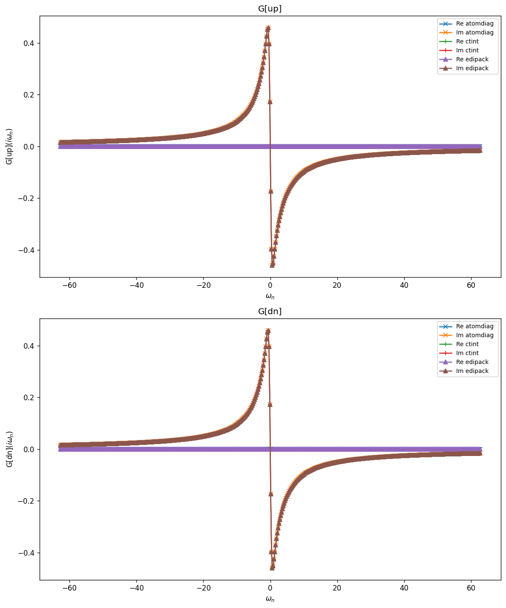
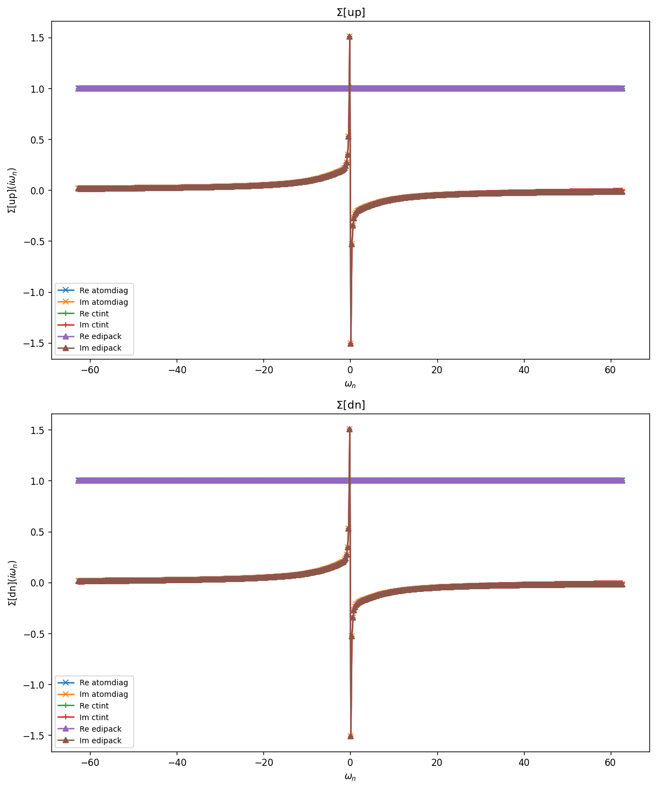
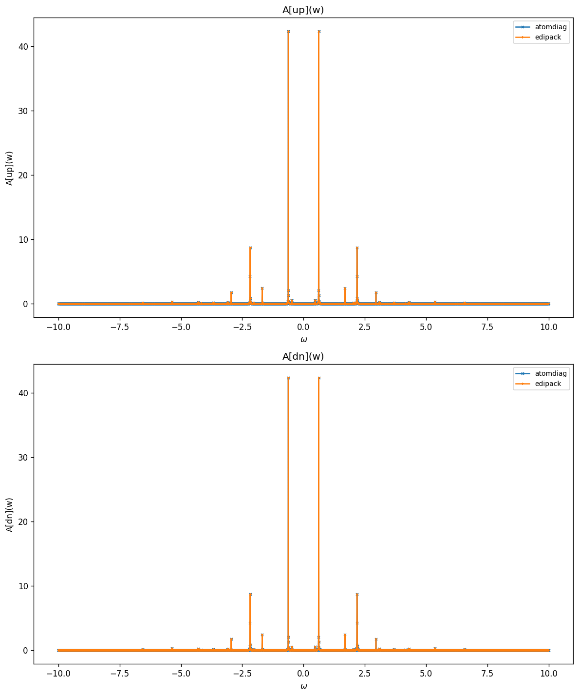
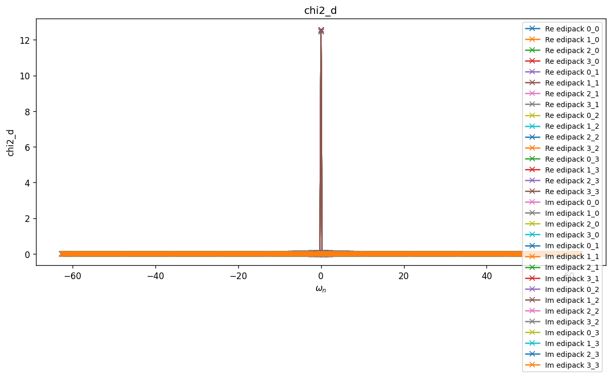
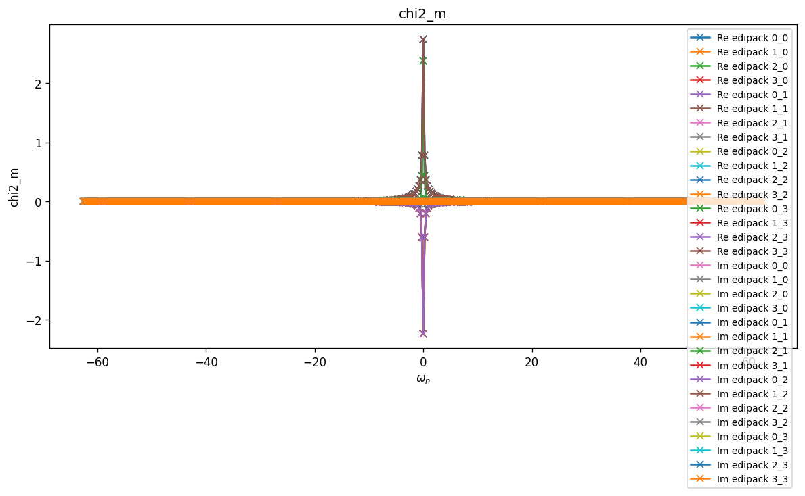
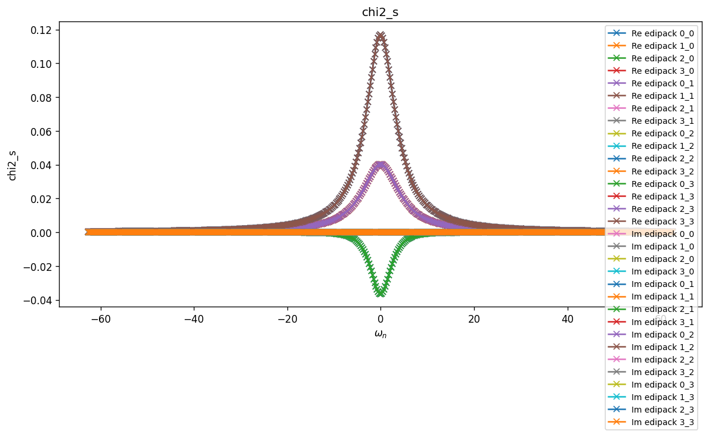
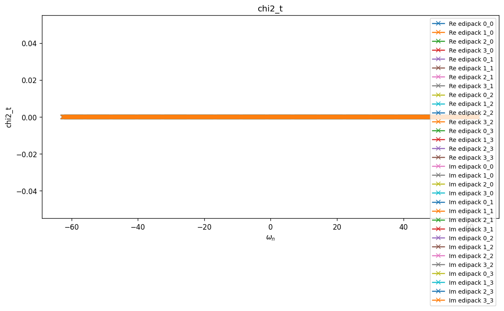

# Plaquette — Isolated 2×2 Hubbard cluster

Four-site $2 \times 2$ cluster with periodic boundary conditions, on-site
Hubbard interaction, and **no bath**:

$$
H = -t \sum_{\langle ij\rangle,\sigma}
        (c^\dagger_{i\sigma} c_{j\sigma} + \mathrm{H.c.})
    - \mu \sum_{i\sigma} n_{i\sigma}
    + U \sum_i n_{i\uparrow} n_{i\downarrow},
$$

at half-filling ($\mu = U/2$). Useful as a finite-size cluster benchmark for
cluster DMFT-style solvers.

## Parameters

| Name | Value |
|------|-------|
| `beta` | 25 |
| `n_iw` | 250 |
| `n_w` | 3001 |
| `broadening` | 0.001 |
| `U` | 2 |
| `mu` | 1 |
| `t` | 1 |
| `n_orb` | 4 |
| `n_orb_bath` | 0 |
| `block_names` | ['up', 'dn'] |

## Solvers

| solver | name | version | git | TRIQS | MPI | run time (s) |
|--------|------|---------|-----|-------|-----|--------------|
| `atomdiag` | atomdiag | 3.3.1 | `7ffa1ad4` | 3.3.1 | 4 | — |
| `ctint` | triqs_ctint | 3.3.0 | `d6d5254c` | 3.3.1 | 4 | 128.7 |
| `edipack` | edipack2triqs | 0.11.0 | `N/A` | 3.3.1 | 4 | 0.6 |

## $G(i\omega_n)$

### G max-norm deviations

| | atomdiag | ctint | edipack |
|---|---|---|---|
| **atomdiag** | — | 1.62e-03 | 7.63e-10 |
| **ctint** |  | — | 1.62e-03 |
| **edipack** |  |  | — |

## $\Sigma(i\omega_n)$

### Sigma max-norm deviations

| | atomdiag | ctint | edipack |
|---|---|---|---|
| **atomdiag** | — | 1.53e-02 | 7.49e-09 |
| **ctint** |  | — | 1.53e-02 |
| **edipack** |  |  | — |

## Static observables

### density

| solver | dn_0 | dn_1 | dn_2 | dn_3 | up_0 | up_1 | up_2 | up_3 |
|---|---|---|---|---|---|---|---|---|
| atomdiag | 0.500000 | 0.500000 | 0.500000 | 0.500000 | 0.500000 | 0.500000 | 0.500000 | 0.500000 |
| ctint | 0.500127 | 0.499898 | 0.499908 | 0.500212 | 0.499873 | 0.500102 | 0.500092 | 0.499788 |
| edipack | 0.500000 | 0.500000 | 0.500000 | 0.500000 | 0.500000 | 0.500000 | 0.500000 | 0.500000 |

### nn_ab

| solver | dn_0,dn_0 | dn_0,dn_1 | dn_0,dn_2 | dn_0,dn_3 | dn_0,up_0 | dn_0,up_1 | dn_0,up_2 | dn_0,up_3 | dn_1,dn_0 | dn_1,dn_1 | dn_1,dn_2 | dn_1,dn_3 | dn_1,up_0 | dn_1,up_1 | dn_1,up_2 | dn_1,up_3 | dn_2,dn_0 | dn_2,dn_1 | dn_2,dn_2 | dn_2,dn_3 | dn_2,up_0 | dn_2,up_1 | dn_2,up_2 | dn_2,up_3 | dn_3,dn_0 | dn_3,dn_1 | dn_3,dn_2 | dn_3,dn_3 | dn_3,up_0 | dn_3,up_1 | dn_3,up_2 | dn_3,up_3 | up_0,dn_0 | up_0,dn_1 | up_0,dn_2 | up_0,dn_3 | up_0,up_0 | up_0,up_1 | up_0,up_2 | up_0,up_3 | up_1,dn_0 | up_1,dn_1 | up_1,dn_2 | up_1,dn_3 | up_1,up_0 | up_1,up_1 | up_1,up_2 | up_1,up_3 | up_2,dn_0 | up_2,dn_1 | up_2,dn_2 | up_2,dn_3 | up_2,up_0 | up_2,up_1 | up_2,up_2 | up_2,up_3 | up_3,dn_0 | up_3,dn_1 | up_3,dn_2 | up_3,dn_3 | up_3,up_0 | up_3,up_1 | up_3,up_2 | up_3,up_3 |
|---|---|---|---|---|---|---|---|---|---|---|---|---|---|---|---|---|---|---|---|---|---|---|---|---|---|---|---|---|---|---|---|---|---|---|---|---|---|---|---|---|---|---|---|---|---|---|---|---|---|---|---|---|---|---|---|---|---|---|---|---|---|---|---|---|
| atomdiag | 0.500000 | 0.112086 | 0.112086 | 0.288876 | 0.115199 | 0.339401 | 0.339401 | 0.192951 | 0.112086 | 0.500000 | 0.288876 | 0.112086 | 0.339401 | 0.115199 | 0.192951 | 0.339401 | 0.112086 | 0.288876 | 0.500000 | 0.112086 | 0.339401 | 0.192951 | 0.115199 | 0.339401 | 0.288876 | 0.112086 | 0.112086 | 0.500000 | 0.192951 | 0.339401 | 0.339401 | 0.115199 | 0.115199 | 0.339401 | 0.339401 | 0.192951 | 0.500000 | 0.112086 | 0.112086 | 0.288876 | 0.339401 | 0.115199 | 0.192951 | 0.339401 | 0.112086 | 0.500000 | 0.288876 | 0.112086 | 0.339401 | 0.192951 | 0.115199 | 0.339401 | 0.112086 | 0.288876 | 0.500000 | 0.112086 | 0.192951 | 0.339401 | 0.339401 | 0.115199 | 0.288876 | 0.112086 | 0.112086 | 0.500000 |
| edipack | 0.500000 |  |  |  | 0.115199 |  |  |  |  | 0.500000 |  |  |  | 0.115199 |  |  |  |  | 0.500000 |  |  |  | 0.115199 |  |  |  |  | 0.500000 |  |  |  | 0.115199 | 0.115199 |  |  |  | 0.500000 |  |  |  |  | 0.115199 |  |  |  | 0.500000 |  |  |  |  | 0.115199 |  |  |  | 0.500000 |  |  |  |  | 0.115199 |  |  |  | 0.500000 |

## Spectral function $A(\omega) = -\tfrac{1}{\pi} \mathrm{Im}\, G^R(\omega)$

### G(w) max-norm deviations

| | atomdiag | edipack |
|---|---|---|
| **atomdiag** | — | 1.61e-07 |
| **edipack** |  | — |

## Two-point susceptibilities $\chi_2$
### chi2_d

_Need at least 2 solvers for deviation table (have 1)._

### chi2_m

_Need at least 2 solvers for deviation table (have 1)._

### chi2_s

_Need at least 2 solvers for deviation table (have 1)._

### chi2_t

_Need at least 2 solvers for deviation table (have 1)._

