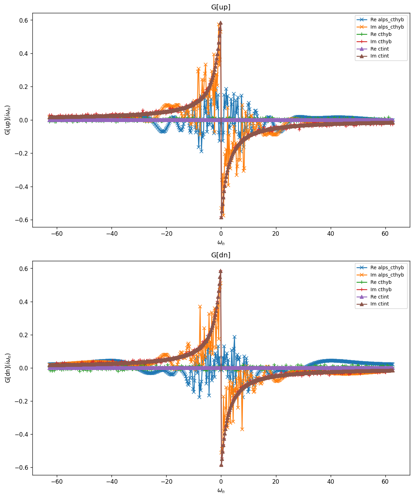
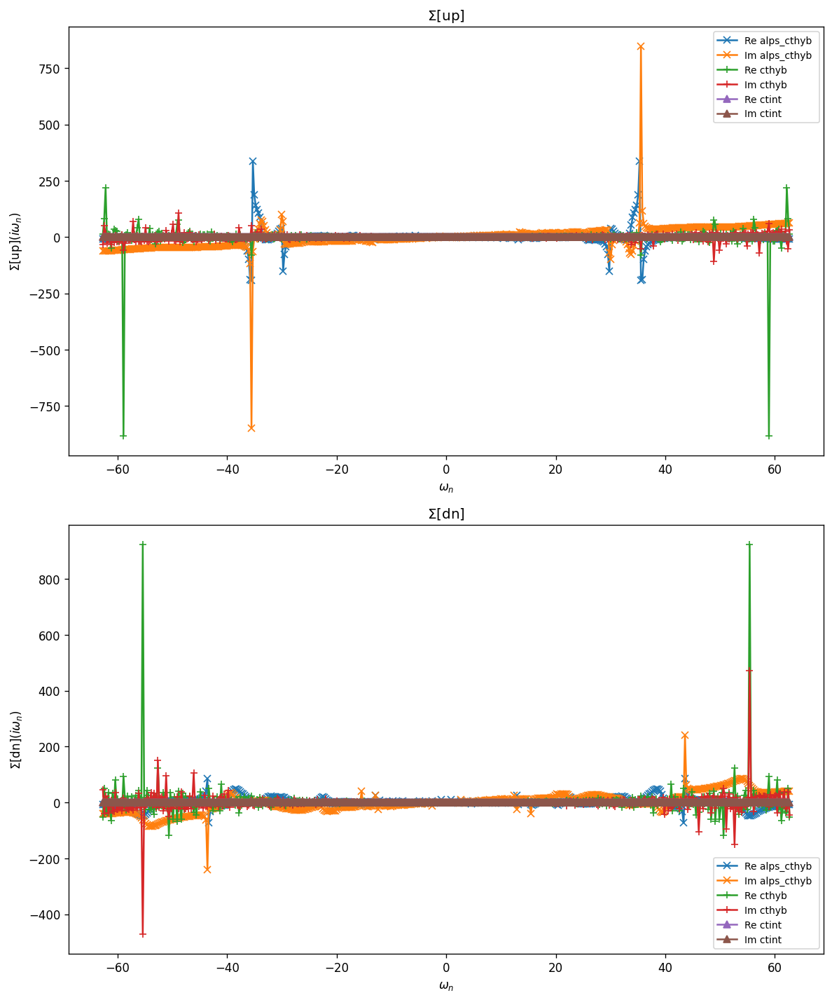

# Plaquette — Wide-band bath

Same 2×2 Hubbard plaquette geometry as `Plaquette` (hopping $t$, on-site $U$),
but coupled to a semicircular (wide-band) bath. The hybridization function is
obtained self-consistently from a semicircular DOS with unit half-bandwidth on
each cluster site, and the interaction is restricted to the on-site Hubbard
term $U\, n_{i\uparrow} n_{i\downarrow}$.

## Parameters

| Name | Value |
|------|-------|
| `beta` | 25 |
| `n_iw` | 250 |
| `broadening` | 0.001 |
| `U` | 2 |
| `mu` | 1 |
| `t` | 1 |
| `n_orb` | 4 |
| `block_names` | ['up', 'dn'] |

## Solvers

| solver | name | version | git | TRIQS | MPI | run time (s) |
|--------|------|---------|-----|-------|-----|--------------|
| `alps_cthyb` | alps_cthyb | N/A | `N/A` | 3.3.1 | 1 | 67.3 |
| `cthyb` | triqs_cthyb | 3.3.0 | `2b720bd7` | 3.3.1 | 4 | 997.2 |
| `ctint` | triqs_ctint | 3.3.0 | `d6d5254c` | 3.3.1 | 4 | 65.6 |

## $G(i\omega_n)$

### G max-norm deviations

| | alps_cthyb | cthyb | ctint |
|---|---|---|---|
| **alps_cthyb** | — | 7.51e-01 | 6.92e-01 |
| **cthyb** |  | — | 3.87e-01 |
| **ctint** |  |  | — |

## $\Sigma(i\omega_n)$

### Sigma max-norm deviations

| | alps_cthyb | cthyb | ctint |
|---|---|---|---|
| **alps_cthyb** | — | 1.05e+03 | 9.57e+02 |
| **cthyb** |  | — | 1.04e+03 |
| **ctint** |  |  | — |

## Static observables

### density

| solver | dn_0 | dn_1 | dn_2 | dn_3 | up_0 | up_1 | up_2 | up_3 |
|---|---|---|---|---|---|---|---|---|
| cthyb | 0.501051 | 0.499368 | 0.499211 | 0.498041 | 0.498668 | 0.499805 | 0.498927 | 0.501670 |
| ctint | 0.499886 | 0.500153 | 0.500278 | 0.499980 | 0.500114 | 0.499847 | 0.499722 | 0.500020 |

### nn_ab

| solver | dn_0,dn_0 | dn_0,dn_1 | dn_0,dn_2 | dn_0,dn_3 | dn_0,up_0 | dn_0,up_1 | dn_0,up_2 | dn_0,up_3 | dn_1,dn_0 | dn_1,dn_1 | dn_1,dn_2 | dn_1,dn_3 | dn_1,up_0 | dn_1,up_1 | dn_1,up_2 | dn_1,up_3 | dn_2,dn_0 | dn_2,dn_1 | dn_2,dn_2 | dn_2,dn_3 | dn_2,up_0 | dn_2,up_1 | dn_2,up_2 | dn_2,up_3 | dn_3,dn_0 | dn_3,dn_1 | dn_3,dn_2 | dn_3,dn_3 | dn_3,up_0 | dn_3,up_1 | dn_3,up_2 | dn_3,up_3 | up_0,dn_0 | up_0,dn_1 | up_0,dn_2 | up_0,dn_3 | up_0,up_0 | up_0,up_1 | up_0,up_2 | up_0,up_3 | up_1,dn_0 | up_1,dn_1 | up_1,dn_2 | up_1,dn_3 | up_1,up_0 | up_1,up_1 | up_1,up_2 | up_1,up_3 | up_2,dn_0 | up_2,dn_1 | up_2,dn_2 | up_2,dn_3 | up_2,up_0 | up_2,up_1 | up_2,up_2 | up_2,up_3 | up_3,dn_0 | up_3,dn_1 | up_3,dn_2 | up_3,dn_3 | up_3,up_0 | up_3,up_1 | up_3,up_2 | up_3,up_3 |
|---|---|---|---|---|---|---|---|---|---|---|---|---|---|---|---|---|---|---|---|---|---|---|---|---|---|---|---|---|---|---|---|---|---|---|---|---|---|---|---|---|---|---|---|---|---|---|---|---|---|---|---|---|---|---|---|---|---|---|---|---|---|---|---|---|
| cthyb | 0.501051 | 0.196971 | 0.196984 | 0.252589 | 0.193608 | 0.265299 | 0.266309 | 0.243954 | 0.196971 | 0.499368 | 0.253215 | 0.197152 | 0.265316 | 0.194244 | 0.241628 | 0.265914 | 0.196984 | 0.253215 | 0.499211 | 0.195480 | 0.265403 | 0.240724 | 0.193030 | 0.267002 | 0.252589 | 0.197152 | 0.195480 | 0.498041 | 0.240727 | 0.263637 | 0.263263 | 0.194231 | 0.193608 | 0.265316 | 0.265403 | 0.240727 | 0.498668 | 0.195122 | 0.195995 | 0.253467 | 0.265299 | 0.194244 | 0.240724 | 0.263637 | 0.195122 | 0.499805 | 0.252595 | 0.195745 | 0.266309 | 0.241628 | 0.193030 | 0.263263 | 0.195995 | 0.252595 | 0.498927 | 0.197751 | 0.243954 | 0.265914 | 0.267002 | 0.194231 | 0.253467 | 0.195745 | 0.197751 | 0.501670 |

