# SIAM — Discrete Bath

Single-orbital impurity Anderson model coupled to a small number of discrete
bath levels with hybridizations $V_k$ and energies $\epsilon_k$:

$$
H = \sum_\sigma (\epsilon_0 - \mu) n_\sigma
    + U\, n_\uparrow n_\downarrow
    + \sum_{k\sigma} \epsilon_k f^\dagger_{k\sigma} f_{k\sigma}
    + \sum_{k\sigma} V_k (c^\dagger_\sigma f_{k\sigma} + \mathrm{H.c.})
$$

giving a hybridization function
$\Delta_\sigma(i\omega_n) = \sum_k |V_k|^2 / (i\omega_n - \epsilon_k)$.

## Parameters

| Name | Value |
|------|-------|
| `beta` | 5 |
| `n_iw` | 50 |
| `n_w` | 3001 |
| `broadening` | 0.001 |
| `U` | 5 |
| `mu` | 2 |
| `h` | 0.2 |
| `n_orb` | 1 |
| `n_orb_bath` | 2 |
| `block_names` | ['up', 'dn'] |

## Solvers

| solver | name | version | git | TRIQS | MPI | run time (s) |
|--------|------|---------|-----|-------|-----|--------------|
| `alps_cthyb` | alps_cthyb | N/A | `N/A` | 3.3.1 | 1 | 62.7 |
| `atomdiag` | atomdiag | 3.3.1 | `7ffa1ad4` | 3.3.1 | 4 | — |
| `cthyb` | triqs_cthyb | 3.3.0 | `2b720bd7` | 3.3.1 | 4 | 229.1 |
| `ctint` | triqs_ctint | 3.3.0 | `d6d5254c` | 3.3.1 | 4 | 161.4 |
| `ctseg` | triqs_ctseg | 3.3.0 | `b8f1388b` | 3.3.1 | 4 | 330.1 |
| `edipack` | edipack2triqs | 0.11.0 | `N/A` | 3.3.1 | 4 | 0.0 |
| `pomerol` | pomerol | N/A | `N/A` | 3.3.1 | 4 | — |
| `pyed` | pyed | N/A | `N/A` | 3.3.1 | 4 | — |
| `w2dyn_cthyb` | w2dyn_cthyb | 3.3.0 | `920c648b` | 3.3.1 | 4 | 66.7 |

## $G(i\omega_n)$

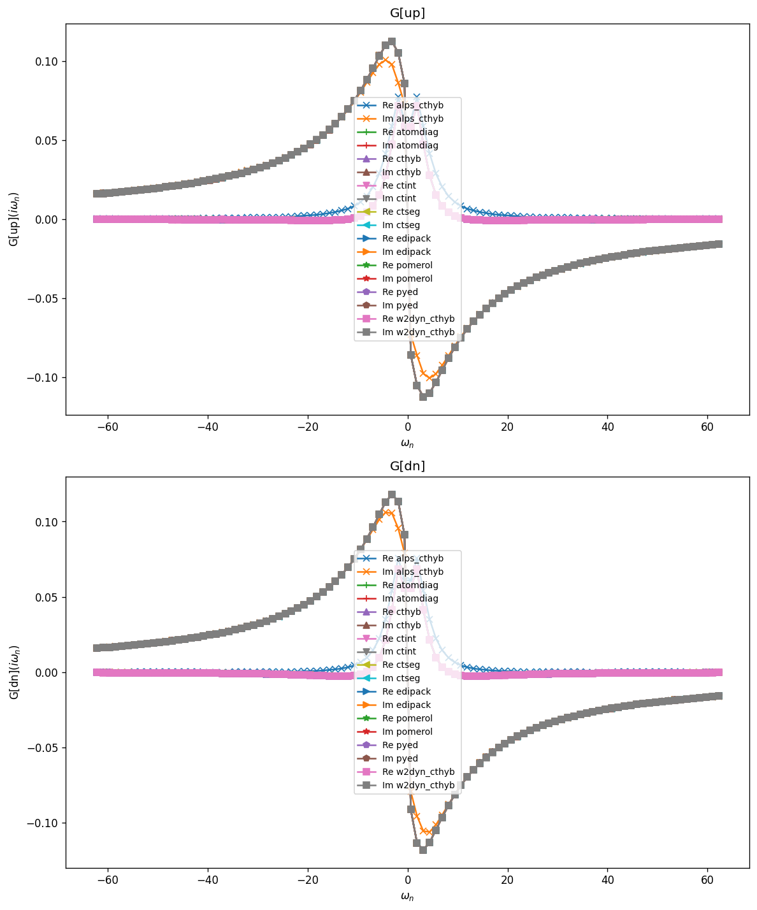

### G max-norm deviations

| | alps_cthyb | atomdiag | cthyb | ctint | ctseg | edipack | pomerol | pyed | w2dyn_cthyb |
|---|---|---|---|---|---|---|---|---|---|
| **alps_cthyb** | — | 1.98e-02 | 1.98e-02 | 1.98e-02 | 1.98e-02 | 1.98e-02 | 1.98e-02 | 1.98e-02 | 1.98e-02 |
| **atomdiag** |  | — | 9.37e-05 | 1.84e-05 | 1.32e-04 | 2.68e-09 | 8.10e-09 | 1.18e-15 | 1.15e-04 |
| **cthyb** |  |  | — | 9.50e-05 | 1.51e-04 | 9.37e-05 | 9.37e-05 | 9.37e-05 | 1.21e-04 |
| **ctint** |  |  |  | — | 1.32e-04 | 1.84e-05 | 1.84e-05 | 1.84e-05 | 1.16e-04 |
| **ctseg** |  |  |  |  | — | 1.32e-04 | 1.32e-04 | 1.32e-04 | 1.81e-04 |
| **edipack** |  |  |  |  |  | — | 8.56e-09 | 2.68e-09 | 1.15e-04 |
| **pomerol** |  |  |  |  |  |  | — | 8.10e-09 | 1.15e-04 |
| **pyed** |  |  |  |  |  |  |  | — | 1.15e-04 |
| **w2dyn_cthyb** |  |  |  |  |  |  |  |  | — |

## $\Sigma(i\omega_n)$

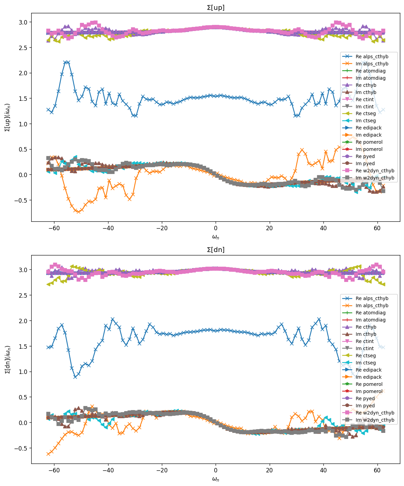

### Sigma max-norm deviations

| | alps_cthyb | atomdiag | cthyb | ctint | ctseg | edipack | pomerol | pyed | w2dyn_cthyb |
|---|---|---|---|---|---|---|---|---|---|
| **alps_cthyb** | — | 2.07e+00 | 2.09e+00 | 2.06e+00 | 2.20e+00 | 2.07e+00 | 2.07e+00 | 2.07e+00 | 2.04e+00 |
| **atomdiag** |  | — | 2.72e-01 | 7.54e-03 | 2.37e-01 | 1.92e-07 | 1.72e-06 | 1.21e-13 | 2.37e-01 |
| **cthyb** |  |  | — | 2.77e-01 | 3.10e-01 | 2.72e-01 | 2.72e-01 | 2.72e-01 | 2.84e-01 |
| **ctint** |  |  |  | — | 2.40e-01 | 7.54e-03 | 7.54e-03 | 7.54e-03 | 2.44e-01 |
| **ctseg** |  |  |  |  | — | 2.37e-01 | 2.37e-01 | 2.37e-01 | 3.27e-01 |
| **edipack** |  |  |  |  |  | — | 1.72e-06 | 1.92e-07 | 2.37e-01 |
| **pomerol** |  |  |  |  |  |  | — | 1.72e-06 | 2.37e-01 |
| **pyed** |  |  |  |  |  |  |  | — | 2.37e-01 |
| **w2dyn_cthyb** |  |  |  |  |  |  |  |  | — |

## Static observables

### density

| solver | dn | up |
|---|---|---|
| atomdiag | 0.556063 | 0.584961 |
| cthyb | 0.555704 | 0.585431 |
| ctint | 0.556051 | 0.584948 |
| ctseg | 0.556136 | 0.584888 |
| edipack | 0.556063 | 0.584961 |
| pomerol |  |  |
| pyed | 0.556063 | 0.584961 |

### nn_ab

| solver | dn,dn | dn,up | up,dn | up,up |
|---|---|---|---|---|
| atomdiag | 0.556063 | 0.295383 | 0.295383 | 0.584961 |
| cthyb | 0.555704 | 0.294915 | 0.294915 | 0.585431 |
| edipack | 0.556063 | 0.295383 | 0.295383 | 0.584961 |
| pomerol |  |  |  |  |
| pyed | 0.556063 | 0.295383 | 0.295383 | 0.584961 |

## Spectral function $A(\omega) = -\tfrac{1}{\pi} \mathrm{Im}\, G^R(\omega)$

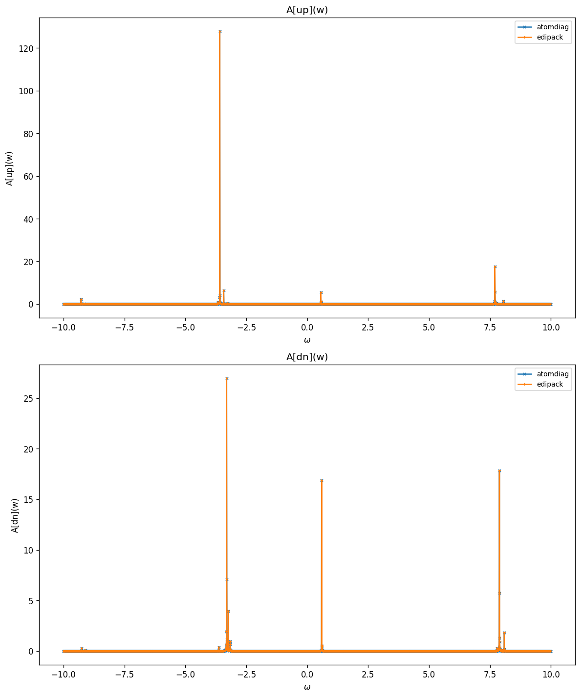

### G(w) max-norm deviations

| | atomdiag | edipack |
|---|---|---|
| **atomdiag** | — | 3.25e-05 |
| **edipack** |  | — |

## Two-point susceptibilities $\chi_2$
### chi2_d

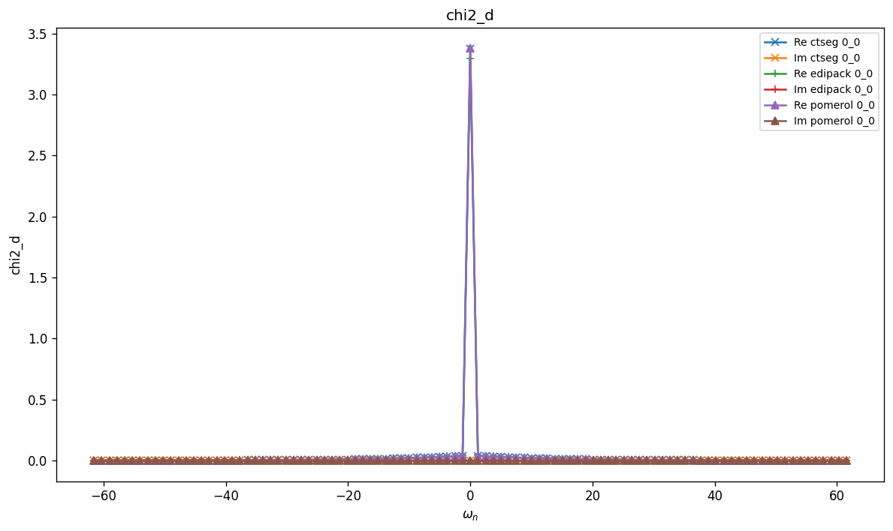

### chi2_d max-norm deviations

| | ctseg | edipack | pomerol |
|---|---|---|---|
| **ctseg** | — | 7.83e-02 | 2.77e-03 |
| **edipack** |  | — | 8.11e-02 |
| **pomerol** |  |  | — |

### chi2_m

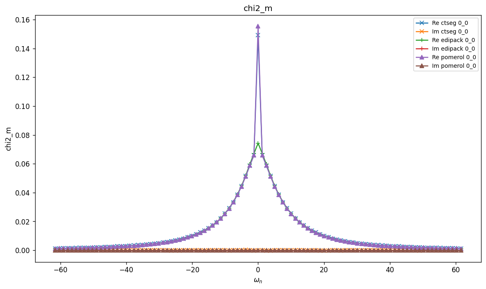

### chi2_m max-norm deviations

| | ctseg | edipack | pomerol |
|---|---|---|---|
| **ctseg** | — | 7.51e-02 | 6.00e-03 |
| **edipack** |  | — | 8.11e-02 |
| **pomerol** |  |  | — |

### chi2_s

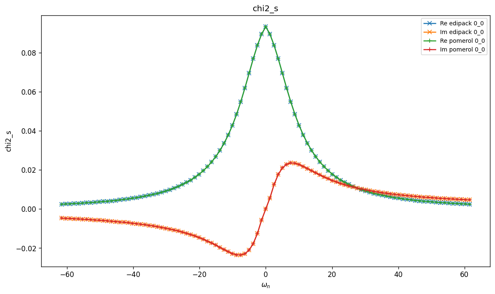

### chi2_s max-norm deviations

| | edipack | pomerol |
|---|---|---|
| **edipack** | — | 8.31e-09 |
| **pomerol** |  | — |

### chi2_t

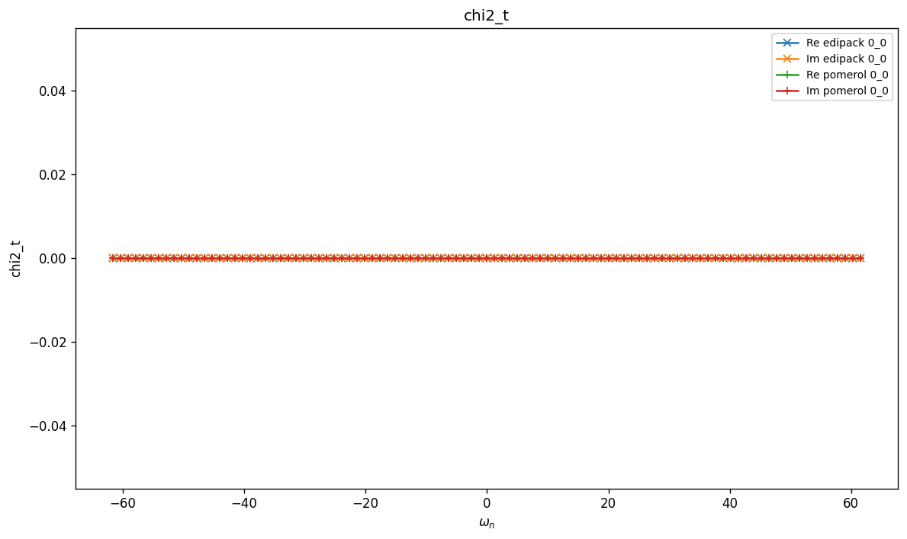

### chi2_t max-norm deviations

| | edipack | pomerol |
|---|---|---|
| **edipack** | — | 0.00e+00 |
| **pomerol** |  | — |

## Three-point correlators $\chi_3$
### chi3_d

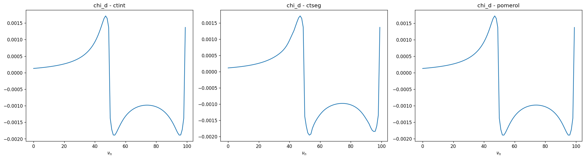

### chi3_d max-norm deviations

| | ctint | ctseg | pomerol |
|---|---|---|---|
| **ctint** | — | 1.27e+00 | 1.10e-04 |
| **ctseg** |  | — | 1.27e+00 |
| **pomerol** |  |  | — |

### chi3_m

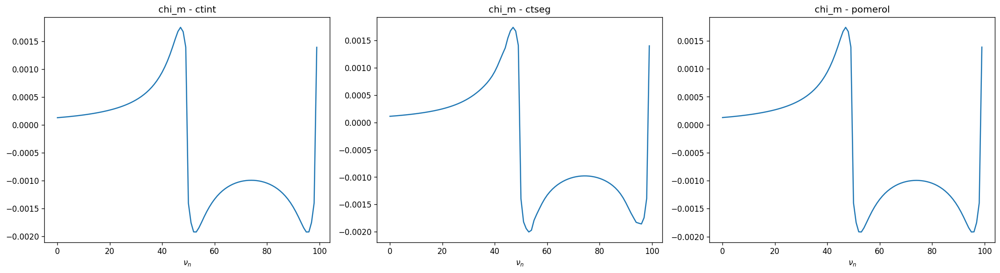

### chi3_m max-norm deviations

| | ctint | ctseg | pomerol |
|---|---|---|---|
| **ctint** | — | 1.69e-04 | 3.49e-05 |
| **ctseg** |  | — | 1.61e-04 |
| **pomerol** |  |  | — |

### chi3_s

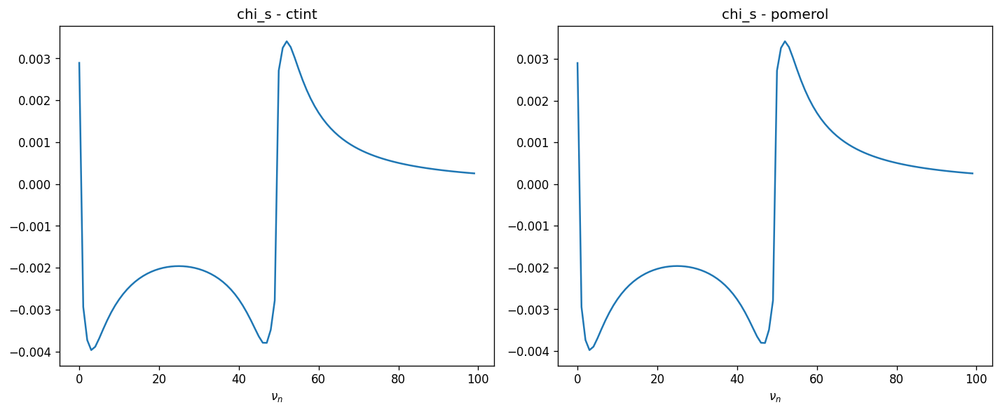

### chi3_s max-norm deviations

| | ctint | pomerol |
|---|---|---|
| **ctint** | — | 7.88e-05 |
| **pomerol** |  | — |

### chi3_t

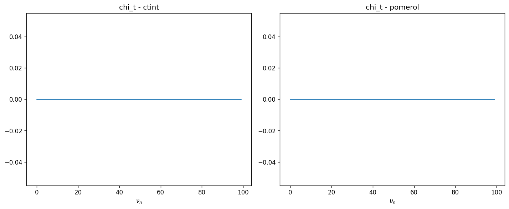

### chi3_t max-norm deviations

| | ctint | pomerol |
|---|---|---|
| **ctint** | — | 0.00e+00 |
| **pomerol** |  | — |

