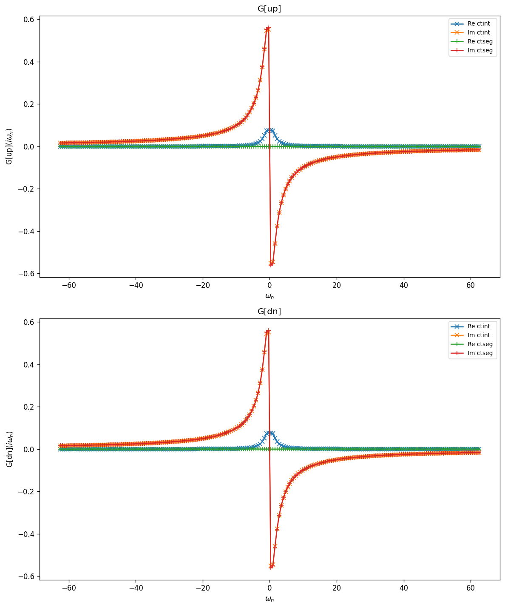
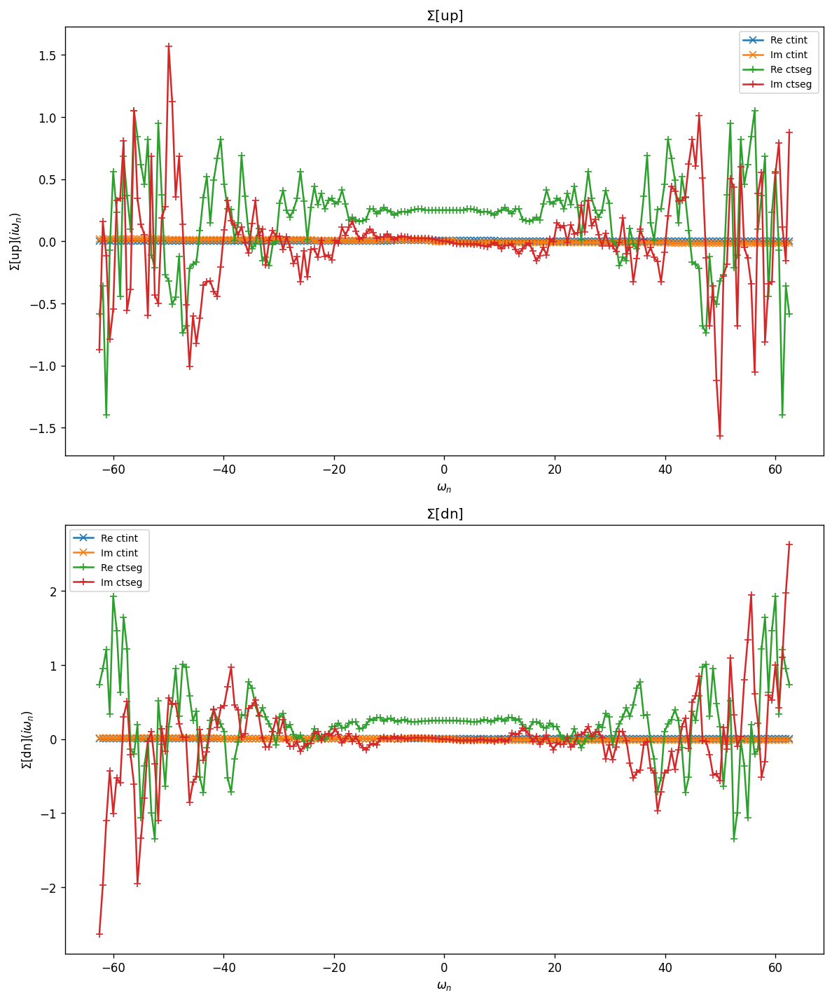
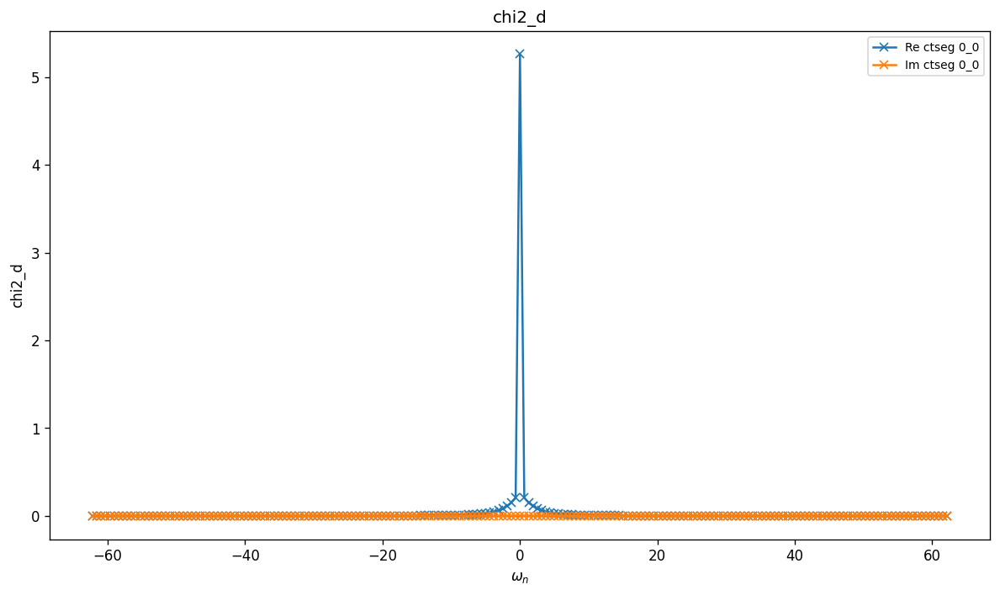
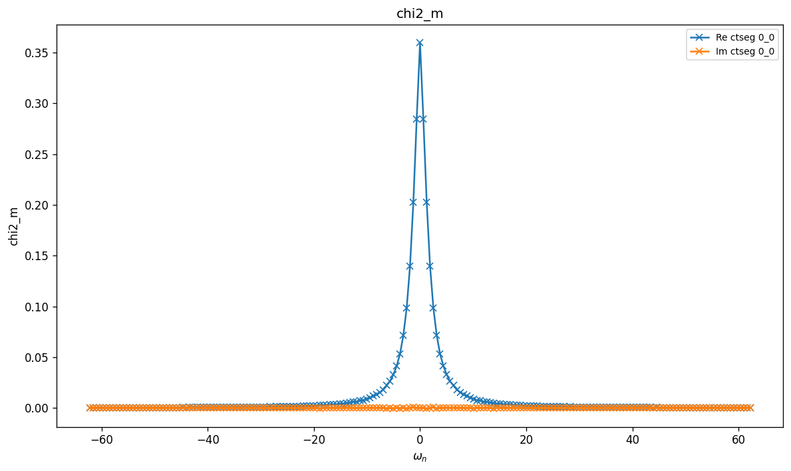
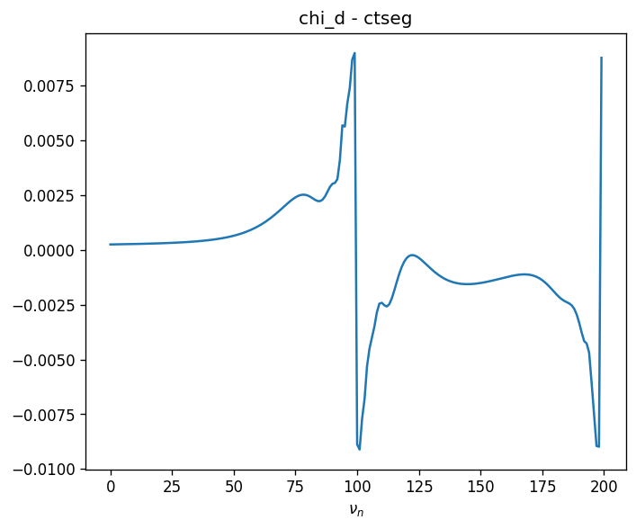
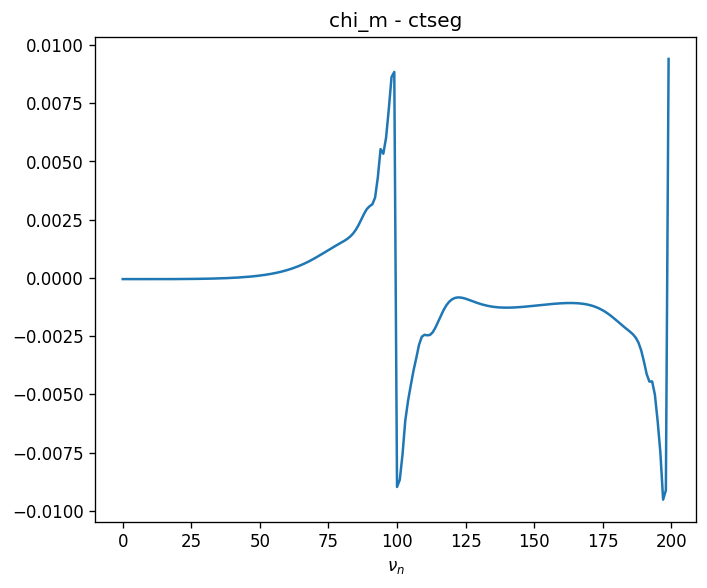

# SIAM — Dynamic U

Single-orbital Anderson impurity with a retarded density–density interaction
$D_0(i\omega)$. The instantaneous part of the interaction is the usual on-site
Hubbard term; the bosonic mode coupling adds a frequency-dependent shift to the
density–density interaction between opposite spins:

$$
D_0(i\omega) = D^2 \left(\frac{1}{\omega - \omega_0} - \frac{1}{\omega + \omega_0}\right),
\qquad
H_{\mathrm{int}} = U\, n_\uparrow n_\downarrow
  + \sum_{\sigma\sigma'} \int\!d\tau\,d\tau'\, D_0(\tau-\tau')\,
    n_\sigma(\tau) n_{\bar\sigma}(\tau').
$$

The bath is a flat semicircular continuum; see `SIAM_SemiCircular` for the static
counterpart.

## Parameters

| Name | Value |
|------|-------|
| `beta` | 10 |
| `n_iw` | 100 |
| `broadening` | 0.001 |
| `U` | 1 |
| `mu` | 0.25 |
| `w0` | 1 |
| `D_coupling` | 0.5 |
| `n_orb` | 1 |
| `block_names` | ['up', 'dn'] |

## Solvers

| solver | name | version | git | TRIQS | MPI | run time (s) |
|--------|------|---------|-----|-------|-----|--------------|
| `ctint` | triqs_ctint | 3.3.0 | `d6d5254c` | 3.3.1 | 4 | 7.9 |
| `ctseg` | triqs_ctseg | 3.3.0 | `b8f1388b` | 3.3.1 | 4 | 189.7 |

## $G(i\omega_n)$

### G max-norm deviations

| | ctint | ctseg |
|---|---|---|
| **ctint** | — | 7.67e-02 |
| **ctseg** |  | — |

## $\Sigma(i\omega_n)$

### Sigma max-norm deviations

| | ctint | ctseg |
|---|---|---|
| **ctint** | — | 2.75e+00 |
| **ctseg** |  | — |

## Static observables

### density

| solver | dn | up |
|---|---|---|
| ctint | 0.575802 | 0.575474 |
| ctseg | 0.500018 | 0.499932 |

_No solver has static_obs/nn_ab._

## Two-point susceptibilities $\chi_2$
### chi2_d

_Need at least 2 solvers for deviation table (have 1)._

### chi2_m

_Need at least 2 solvers for deviation table (have 1)._

## Three-point correlators $\chi_3$
### chi3_d

_Need at least 2 solvers for deviation table (have 1)._

### chi3_m

_Need at least 2 solvers for deviation table (have 1)._

