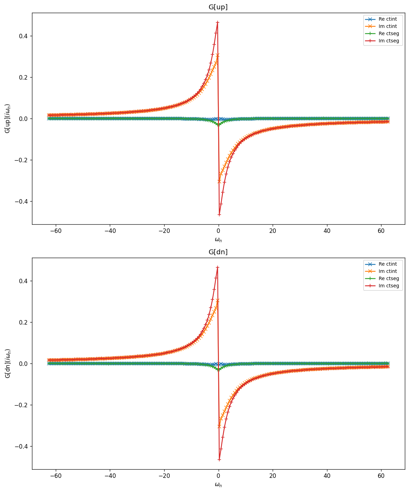
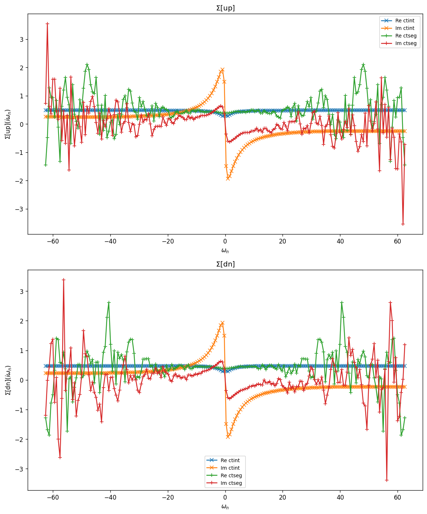
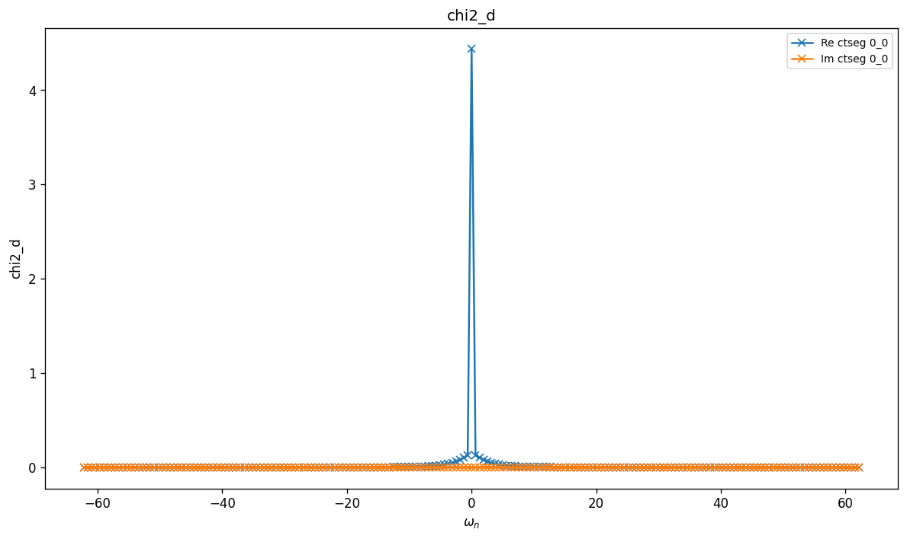
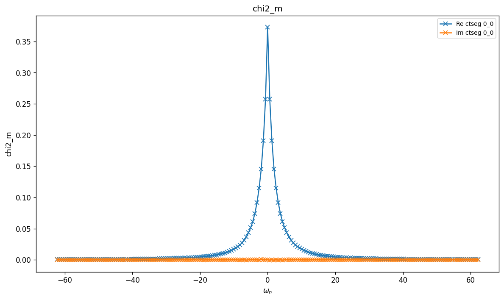
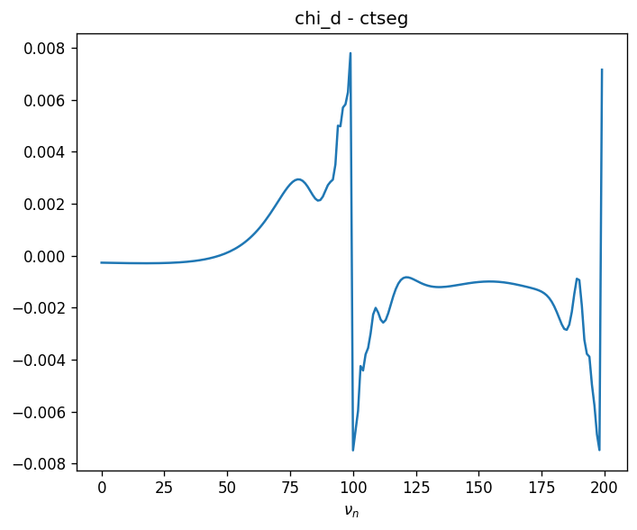
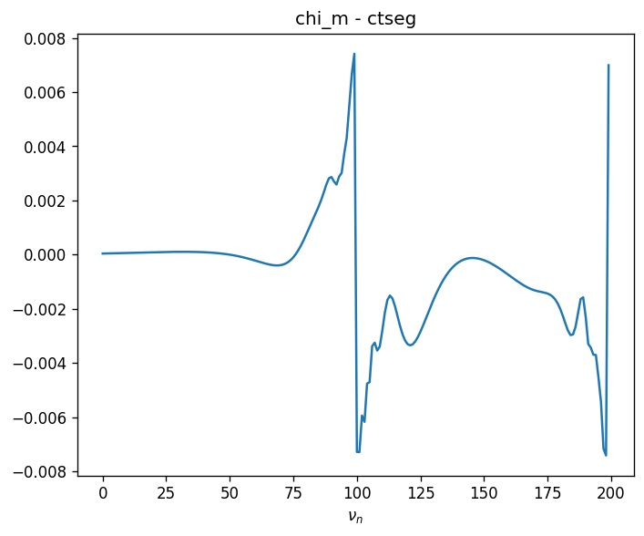

# SIAM — Dynamic $J_\perp$

Single-orbital Anderson impurity with a retarded transverse spin–spin coupling
$J_\perp(i\omega)$ (a dynamic Kondo-like interaction):

$$
J_\perp(i\omega) = \tfrac{1}{2} J^2 \left(\frac{1}{\omega - \omega_0} - \frac{1}{\omega + \omega_0}\right),
\qquad
H_{\mathrm{int}}(\tau,\tau') = U\, n_\uparrow(\tau) n_\downarrow(\tau)
  + \tfrac{1}{2}\! \int\!d\tau\,d\tau'\, J_\perp(\tau-\tau')\,
  \big(S^+(\tau) S^-(\tau') + \mathrm{H.c.}\big).
$$

The bath is a flat semicircular continuum. Unlike the $D_0$ case in
`SIAM_DynU`, this retarded coupling acts in the spin-flip channel.

## Parameters

| Name | Value |
|------|-------|
| `beta` | 10 |
| `n_iw` | 100 |
| `broadening` | 0.001 |
| `U` | 1 |
| `J` | 2 |
| `mu` | 0.25 |
| `w0` | 1 |
| `n_orb` | 1 |
| `block_names` | ['up', 'dn'] |

## Solvers

| solver | name | version | git | TRIQS | MPI | run time (s) |
|--------|------|---------|-----|-------|-----|--------------|
| `ctint` | triqs_ctint | 3.3.0 | `d6d5254c` | 3.3.1 | 4 | 63.1 |
| `ctseg` | triqs_ctseg | 3.3.0 | `b8f1388b` | 3.3.1 | 4 | 234.4 |

## $G(i\omega_n)$

### G max-norm deviations

| | ctint | ctseg |
|---|---|---|
| **ctint** | — | 1.62e-01 |
| **ctseg** |  | — |

## $\Sigma(i\omega_n)$

### Sigma max-norm deviations

| | ctint | ctseg |
|---|---|---|
| **ctint** | — | 3.43e+00 |
| **ctseg** |  | — |

## Static observables

### density

| solver | dn | up |
|---|---|---|
| ctint | 0.480385 | 0.480023 |
| ctseg | 0.462931 | 0.462551 |

_No solver has static_obs/nn_ab._

## Two-point susceptibilities $\chi_2$
### chi2_d

_Need at least 2 solvers for deviation table (have 1)._

### chi2_m

_Need at least 2 solvers for deviation table (have 1)._

## Three-point correlators $\chi_3$
### chi3_d

_Need at least 2 solvers for deviation table (have 1)._

### chi3_m

_Need at least 2 solvers for deviation table (have 1)._

