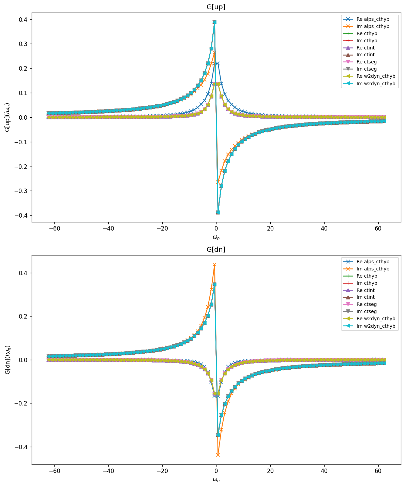
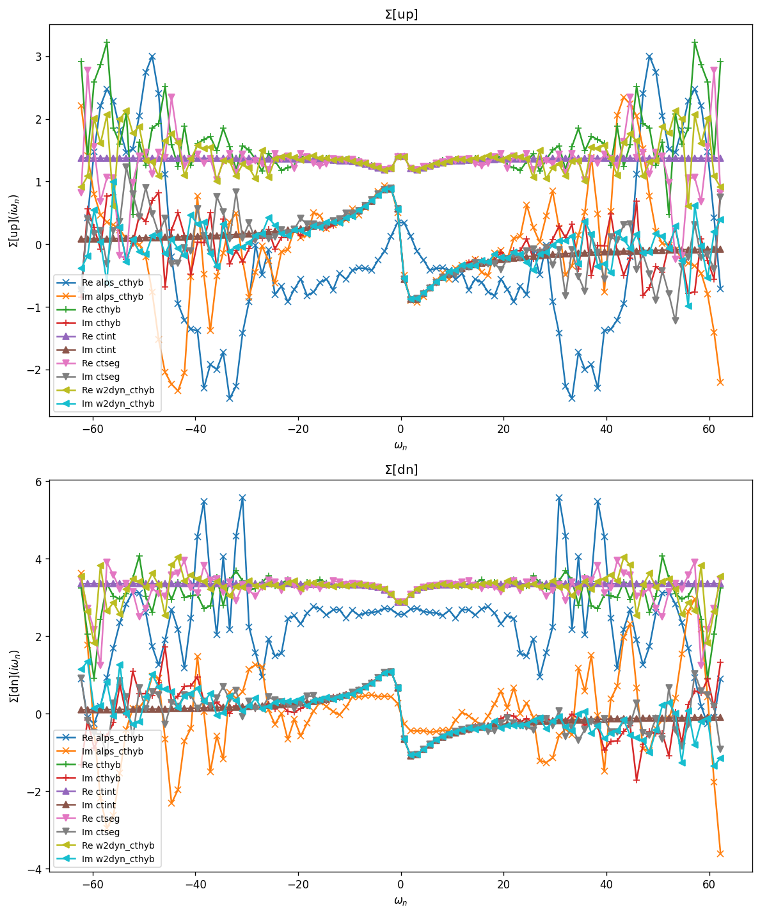
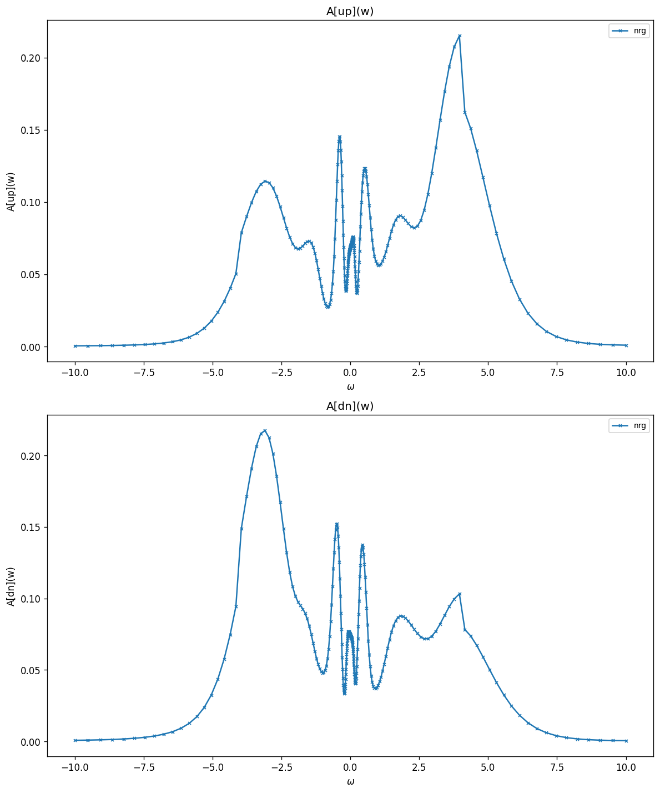
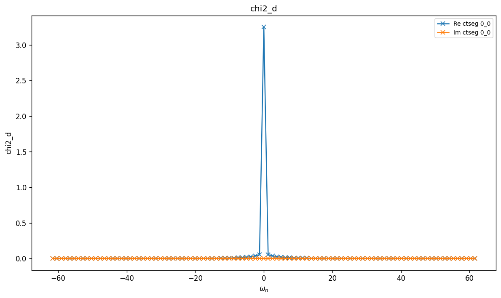
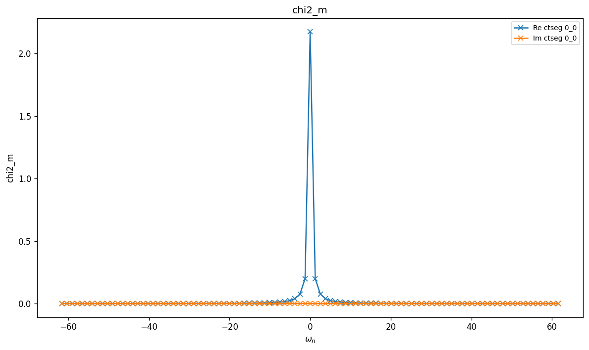
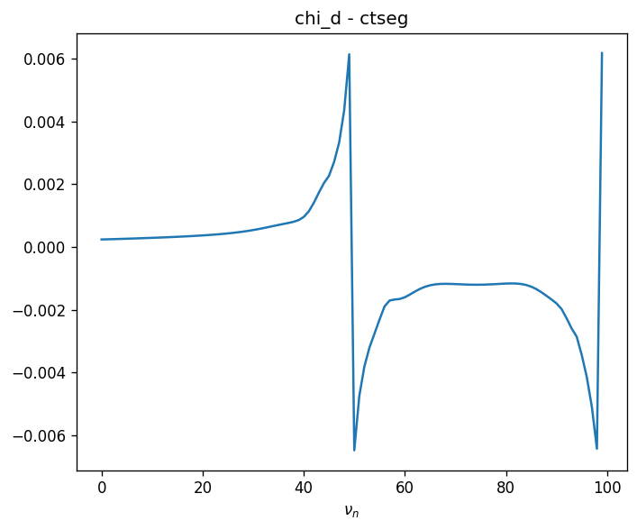
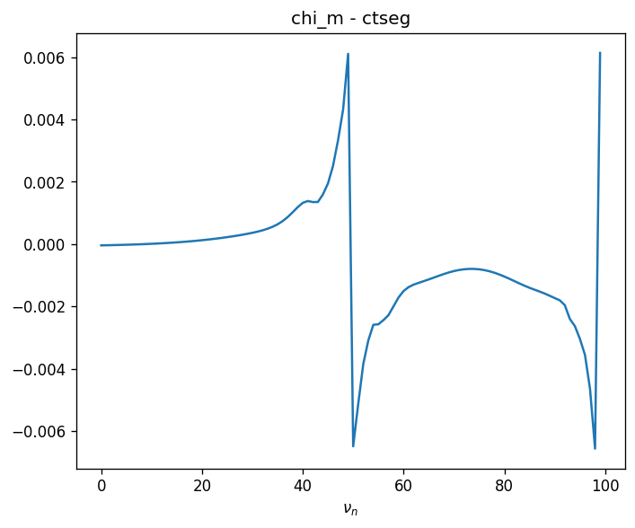

# SIAM — Wide Band (Semicircular)

Single-orbital impurity Anderson model with a wide-band (continuous) bath. The
hybridization function is fixed by imposing a semicircular local density of states
$\rho(\omega) = \tfrac{2}{\pi D^2}\sqrt{D^2 - \omega^2}$ of half-bandwidth $D=1$:

$$
\Delta(i\omega_n) = i\omega_n + \mu - G^{-1}_0(i\omega_n),
\qquad G_0(i\omega_n) = \big[i\omega_n + \mu - \Sigma_{\mathrm{SC}}(i\omega_n)\big]^{-1},
$$

and the local interaction is
$H_{\mathrm{int}} = -\mu(n_\uparrow + n_\downarrow) - h(n_\uparrow - n_\downarrow) + U n_\uparrow n_\downarrow$.

## Parameters

| Name | Value |
|------|-------|
| `beta` | 5 |
| `n_iw` | 50 |
| `broadening` | 0.001 |
| `U` | 5 |
| `mu` | 2 |
| `h` | 0.2 |
| `n_orb` | 1 |
| `block_names` | ['up', 'dn'] |

## Solvers

| solver | name | version | git | TRIQS | MPI | run time (s) |
|--------|------|---------|-----|-------|-----|--------------|
| `alps_cthyb` | alps_cthyb | N/A | `N/A` | 3.3.1 | 1 | 62.9 |
| `cthyb` | triqs_cthyb | 3.3.0 | `2b720bd7` | 3.3.1 | 4 | 28.4 |
| `ctint` | triqs_ctint | 3.3.0 | `d6d5254c` | 3.3.1 | 4 | 46.0 |
| `ctseg` | triqs_ctseg | 3.3.0 | `b8f1388b` | 3.3.1 | 4 | 73.1 |
| `nrg` | nrgljubljana | 3.3.0 | `b056b7e7` | 3.3.1 | 4 | 12.4 |
| `w2dyn_cthyb` | w2dyn_cthyb | 3.3.0 | `920c648b` | 3.3.1 | 4 | 32.6 |

## $G(i\omega_n)$

### G max-norm deviations

| | alps_cthyb | cthyb | ctint | ctseg | w2dyn_cthyb |
|---|---|---|---|---|---|
| **alps_cthyb** | — | 1.50e-01 | 1.50e-01 | 1.49e-01 | 1.49e-01 |
| **cthyb** |  | — | 7.50e-04 | 9.50e-04 | 6.52e-04 |
| **ctint** |  |  | — | 8.27e-04 | 5.62e-04 |
| **ctseg** |  |  |  | — | 9.68e-04 |
| **w2dyn_cthyb** |  |  |  |  | — |

## $\Sigma(i\omega_n)$

### Sigma max-norm deviations

| | alps_cthyb | cthyb | ctint | ctseg | w2dyn_cthyb |
|---|---|---|---|---|---|
| **alps_cthyb** | — | 5.47e+00 | 4.29e+00 | 3.92e+00 | 4.35e+00 |
| **cthyb** |  | — | 2.64e+00 | 2.75e+00 | 2.49e+00 |
| **ctint** |  |  | — | 2.22e+00 | 1.53e+00 |
| **ctseg** |  |  |  | — | 2.82e+00 |
| **w2dyn_cthyb** |  |  |  |  | — |

## Static observables

### density

| solver | dn | up |
|---|---|---|
| cthyb | 0.274309 | 0.671008 |
| ctint | 0.274658 | 0.670687 |
| ctseg | 0.274558 | 0.670925 |
| nrg | 0.579580 | 0.359530 |

### nn_ab

| solver | dn,dn | dn,up | up,dn | up,up |
|---|---|---|---|---|
| cthyb | 0.274309 | 0.064992 | 0.064992 | 0.671008 |

## Spectral function $A(\omega) = -\tfrac{1}{\pi} \mathrm{Im}\, G^R(\omega)$

_Need at least 2 solvers for deviation table (have 1)._

## Two-point susceptibilities $\chi_2$
### chi2_d

_Need at least 2 solvers for deviation table (have 1)._

### chi2_m

_Need at least 2 solvers for deviation table (have 1)._

## Three-point correlators $\chi_3$
### chi3_d

_Need at least 2 solvers for deviation table (have 1)._

### chi3_m

_Need at least 2 solvers for deviation table (have 1)._

