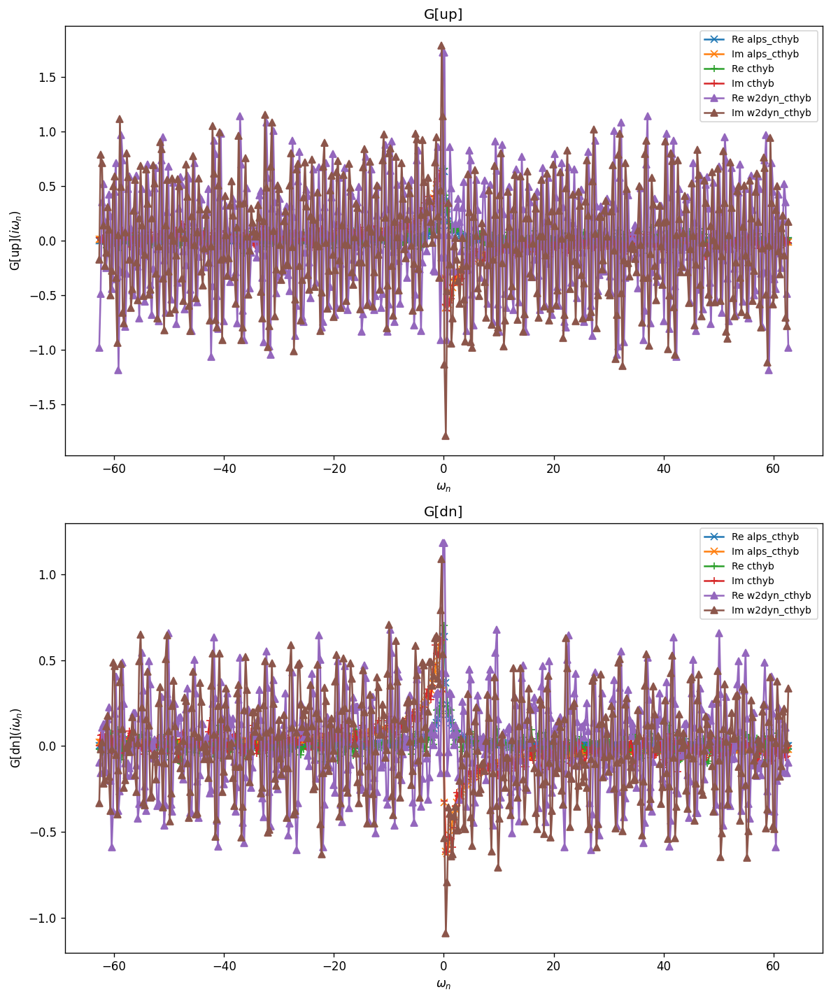
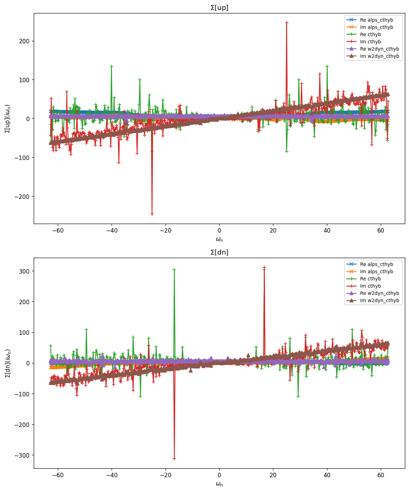

# Sr$_2$RuO$_4$ — Three-band Kanamori DMFT

Three-orbital effective model for the $t_{2g}$ shell of the layered perovskite
Sr$_2$RuO$_4$, obtained from a Wannier90 Hamiltonian. Kanamori interaction
$(U, J)$ on the three $t_{2g}$ orbitals; hybridization follows from the
lattice Green function summed over the Brillouin zone:

$$
H_{\mathrm{loc}} = \sum_{\alpha\beta\sigma}
    (h_0^{\alpha\beta} - \mu\delta_{\alpha\beta})
     c^\dagger_{\alpha\sigma} c_{\beta\sigma}
  + H_{\mathrm{int}}^{\mathrm{Kanamori}}(U, U'=U-2J, J).
$$

Spin–orbit coupling is added in the companion model `Sr2RuO4_SOC`.

## Parameters

| Name | Value |
|------|-------|
| `beta` | 25 |
| `n_iw` | 250 |
| `broadening` | 0.001 |
| `U` | 2.3 |
| `J` | 0.4 |
| `mu` | 5.3938 |
| `n_orb` | 3 |
| `block_names` | ['up', 'dn'] |

## Solvers

| solver | name | version | git | TRIQS | MPI | run time (s) |
|--------|------|---------|-----|-------|-----|--------------|
| `alps_cthyb` | alps_cthyb | N/A | `N/A` | 3.3.1 | 1 | 65.6 |
| `cthyb` | triqs_cthyb | 3.3.0 | `2b720bd7` | 3.3.1 | 16 | 1161.9 |
| `w2dyn_cthyb` | w2dyn_cthyb | 3.3.0 | `920c648b` | 3.3.1 | 16 | 39.1 |

## $G(i\omega_n)$

### G max-norm deviations

| | alps_cthyb | cthyb | w2dyn_cthyb |
|---|---|---|---|
| **alps_cthyb** | — | 5.02e-01 | 1.36e+00 |
| **cthyb** |  | — | 1.36e+00 |
| **w2dyn_cthyb** |  |  | — |

## $\Sigma(i\omega_n)$

### Sigma max-norm deviations

| | alps_cthyb | cthyb | w2dyn_cthyb |
|---|---|---|---|
| **alps_cthyb** | — | 4.33e+02 | 2.56e+02 |
| **cthyb** |  | — | 4.21e+02 |
| **w2dyn_cthyb** |  |  | — |

## Static observables

### density

| solver | dn_0 | dn_1 | dn_2 | up_0 | up_1 | up_2 |
|---|---|---|---|---|---|---|
| cthyb | 0.760926 | 0.622817 | 0.622764 | 0.761330 | 0.623070 | 0.622878 |

### nn_ab

| solver | dn_0,dn_0 | dn_0,dn_1 | dn_0,dn_2 | dn_0,up_0 | dn_0,up_1 | dn_0,up_2 | dn_1,dn_0 | dn_1,dn_1 | dn_1,dn_2 | dn_1,up_0 | dn_1,up_1 | dn_1,up_2 | dn_2,dn_0 | dn_2,dn_1 | dn_2,dn_2 | dn_2,up_0 | dn_2,up_1 | dn_2,up_2 | up_0,dn_0 | up_0,dn_1 | up_0,dn_2 | up_0,up_0 | up_0,up_1 | up_0,up_2 | up_1,dn_0 | up_1,dn_1 | up_1,dn_2 | up_1,up_0 | up_1,up_1 | up_1,up_2 | up_2,dn_0 | up_2,dn_1 | up_2,dn_2 | up_2,up_0 | up_2,up_1 | up_2,up_2 |
|---|---|---|---|---|---|---|---|---|---|---|---|---|---|---|---|---|---|---|---|---|---|---|---|---|---|---|---|---|---|---|---|---|---|---|---|---|
| cthyb | 0.760926 | 0.463010 | 0.462993 | 0.522256 | 0.423641 | 0.423446 | 0.463010 | 0.622817 | 0.415851 | 0.423848 | 0.245888 | 0.330833 | 0.462993 | 0.415851 | 0.622764 | 0.423772 | 0.331018 | 0.245642 | 0.522256 | 0.423848 | 0.423772 | 0.761330 | 0.463317 | 0.463373 | 0.423641 | 0.245888 | 0.331018 | 0.463317 | 0.623070 | 0.416326 | 0.423446 | 0.330833 | 0.245642 | 0.463373 | 0.416326 | 0.622878 |

