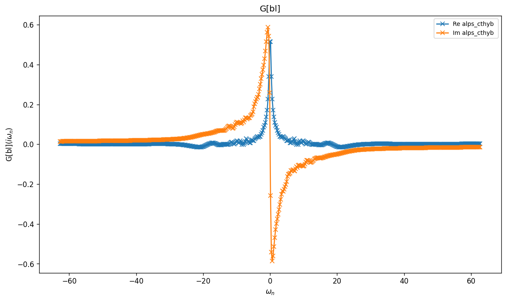
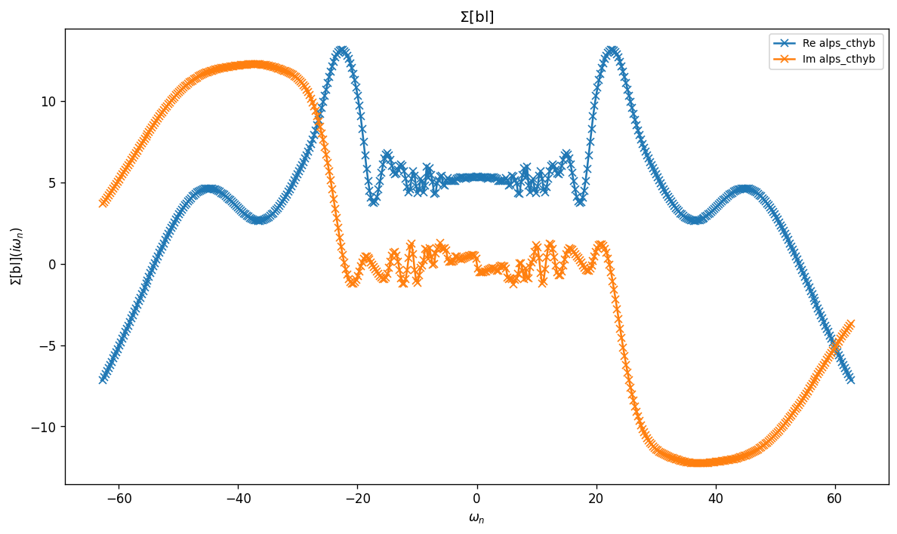

# Sr$_2$RuO$_4$ — Three-band Kanamori DMFT with SOC

Same three-orbital $t_{2g}$ effective model as `Sr2RuO4`, but with an on-site
spin–orbit coupling term added to $h_0$. Spin and orbital indices are no longer
independent, so the model uses a single combined block covering all six
spin–orbitals.

The interaction is still Kanamori $(U, J)$ acting in the original orbital
basis; SOC rotates the one-body part only.

## Parameters

| Name | Value |
|------|-------|
| `beta` | 25 |
| `n_iw` | 250 |
| `broadening` | 0.001 |
| `U` | 2.3 |
| `J` | 0.4 |
| `mu` | 5.3938 |
| `block_names` | ['up', 'dn'] |

## Solvers

| solver | name | version | git | TRIQS | MPI | run time (s) |
|--------|------|---------|-----|-------|-----|--------------|
| `alps_cthyb` | alps_cthyb | N/A | `N/A` | 3.3.1 | 1 | 64.9 |

## $G(i\omega_n)$

_Need at least 2 solvers for deviation table (have 1)._

## $\Sigma(i\omega_n)$

_Need at least 2 solvers for deviation table (have 1)._

## Static observables

_No solver has static_obs/density._

_No solver has static_obs/nn_ab._

