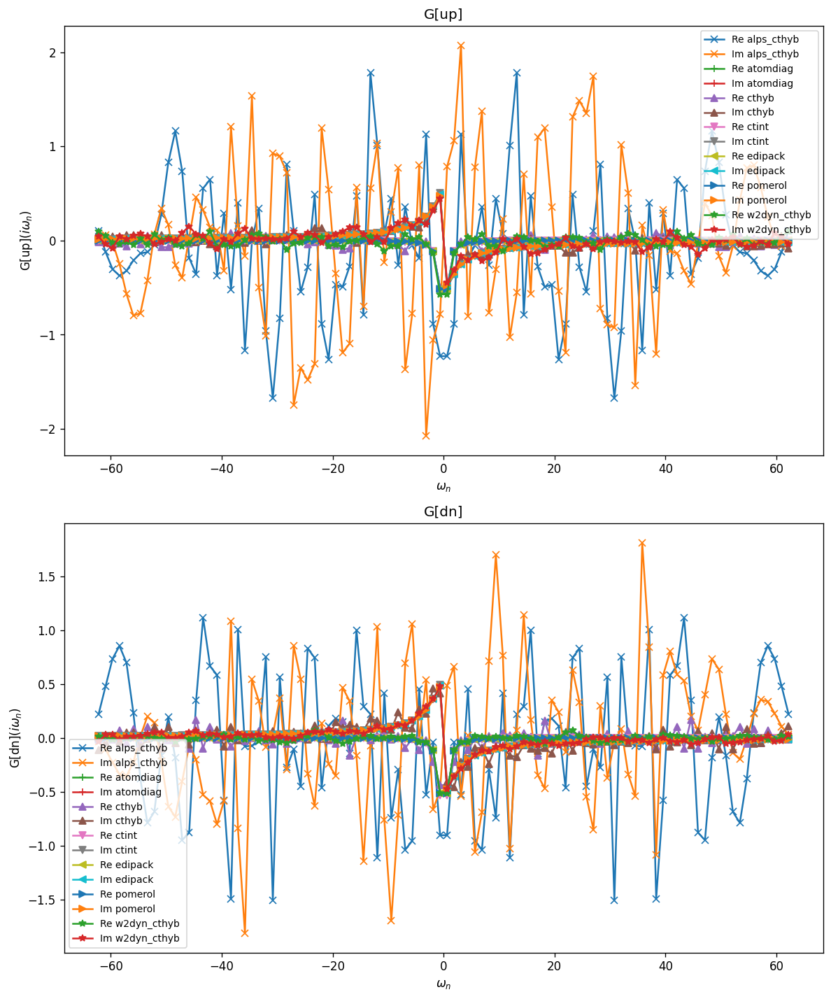
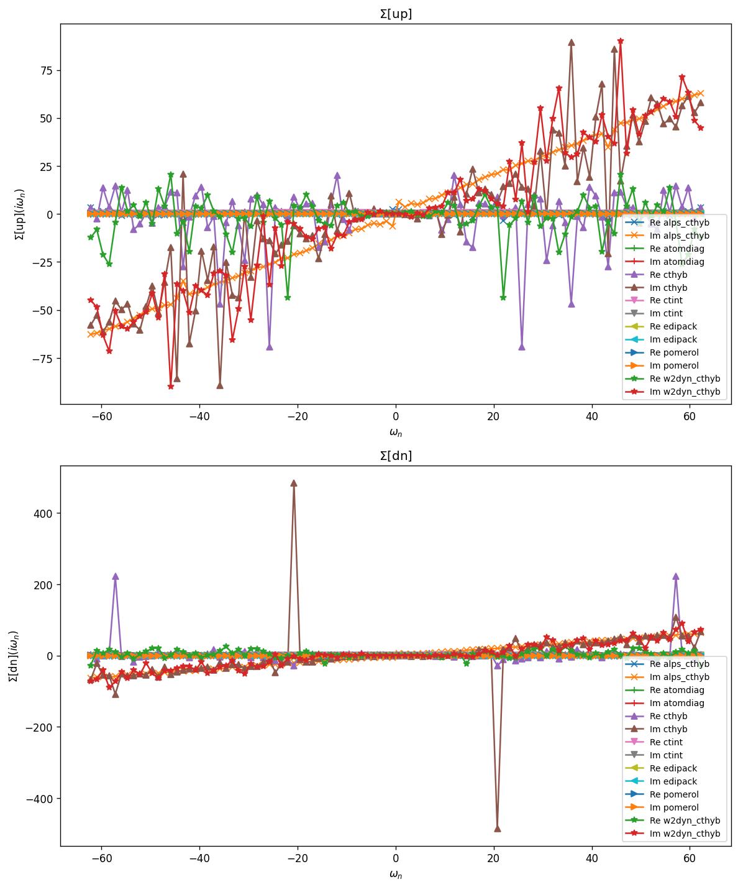
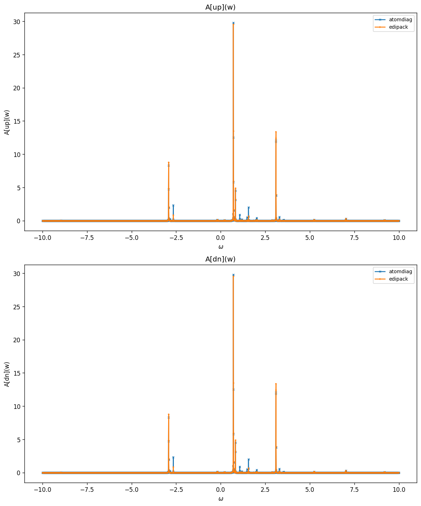
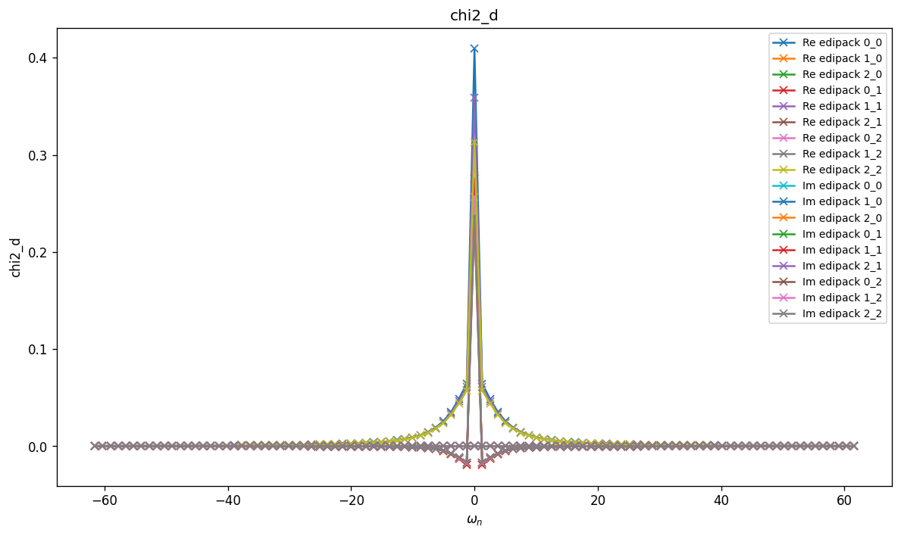
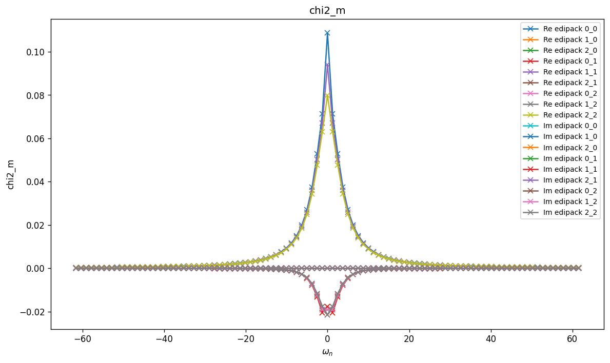
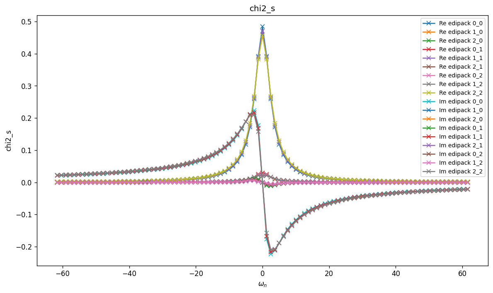
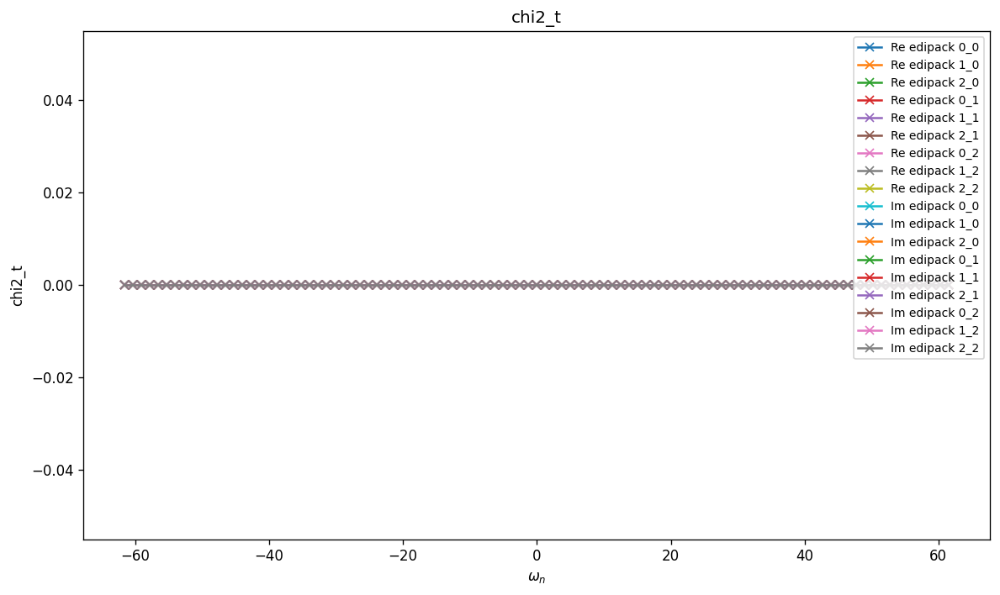

# Trimer — Kanamori + discrete bath

Three-orbital (three-site) impurity with inter-site hopping $t$, a Kanamori
interaction $(U, U', J)$, and a three-level discrete bath — a direct
generalisation of `Dimer`. The non-interacting part couples the three sites
via the hopping matrix, and each site hybridises with its own bath level.

See `Dimer` for the Kanamori form of $H_{\mathrm{int}}$.

## Parameters

| Name | Value |
|------|-------|
| `beta` | 5 |
| `n_iw` | 50 |
| `n_w` | 3001 |
| `broadening` | 0.001 |
| `U` | 1 |
| `J` | 0.2 |
| `mu` | 0 |
| `t` | 0.2 |
| `n_orb` | 3 |
| `n_orb_bath` | 3 |
| `block_names` | ['up', 'dn'] |

## Solvers

| solver | name | version | git | TRIQS | MPI | run time (s) |
|--------|------|---------|-----|-------|-----|--------------|
| `alps_cthyb` | alps_cthyb | N/A | `N/A` | 3.3.1 | 1 | 63.3 |
| `atomdiag` | atomdiag | 3.3.1 | `7ffa1ad4` | 3.3.1 | 4 | — |
| `cthyb` | triqs_cthyb | 3.3.0 | `2b720bd7` | 3.3.1 | 4 | 1303.2 |
| `ctint` | triqs_ctint | 3.3.0 | `d6d5254c` | 3.3.1 | 4 | 120.2 |
| `edipack` | edipack2triqs | 0.11.0 | `N/A` | 3.3.1 | 4 | 11.5 |
| `pomerol` | pomerol | N/A | `N/A` | 3.3.1 | 4 | — |
| `w2dyn_cthyb` | w2dyn_cthyb | 3.3.0 | `920c648b` | 3.3.1 | 4 | 472.9 |

## $G(i\omega_n)$

### G max-norm deviations

| | alps_cthyb | atomdiag | cthyb | ctint | edipack | pomerol | w2dyn_cthyb |
|---|---|---|---|---|---|---|---|
| **alps_cthyb** | — | 2.80e+00 | 2.82e+00 | 2.80e+00 | 2.80e+00 | 2.80e+00 | 2.84e+00 |
| **atomdiag** |  | — | 1.77e-01 | 3.43e-02 | 1.18e-02 | 1.85e-06 | 1.81e-01 |
| **cthyb** |  |  | — | 1.77e-01 | 1.77e-01 | 1.77e-01 | 2.24e-01 |
| **ctint** |  |  |  | — | 2.66e-02 | 3.43e-02 | 1.81e-01 |
| **edipack** |  |  |  |  | — | 1.18e-02 | 1.81e-01 |
| **pomerol** |  |  |  |  |  | — | 1.81e-01 |
| **w2dyn_cthyb** |  |  |  |  |  |  | — |

## $\Sigma(i\omega_n)$

### Sigma max-norm deviations

| | alps_cthyb | atomdiag | cthyb | ctint | edipack | pomerol | w2dyn_cthyb |
|---|---|---|---|---|---|---|---|
| **alps_cthyb** | — | 6.48e+01 | 5.06e+02 | 6.52e+01 | 6.48e+01 | 6.48e+01 | 1.07e+02 |
| **atomdiag** |  | — | 4.86e+02 | 1.29e+00 | 2.66e-02 | 7.52e-04 | 1.06e+02 |
| **cthyb** |  |  | — | 4.86e+02 | 4.86e+02 | 4.86e+02 | 4.87e+02 |
| **ctint** |  |  |  | — | 1.29e+00 | 1.29e+00 | 1.06e+02 |
| **edipack** |  |  |  |  | — | 2.66e-02 | 1.06e+02 |
| **pomerol** |  |  |  |  |  | — | 1.06e+02 |
| **w2dyn_cthyb** |  |  |  |  |  |  | — |

## Static observables

### density

| solver | dn_0 | dn_1 | dn_2 | up_0 | up_1 | up_2 |
|---|---|---|---|---|---|---|
| atomdiag | 0.187867 | 0.174914 | 0.162899 | 0.187867 | 0.174914 | 0.162899 |
| cthyb | 0.187798 | 0.172179 | 0.162660 | 0.187907 | 0.173377 | 0.162524 |
| ctint | 0.174694 | 0.156719 | 0.155717 | 0.167519 | 0.160440 | 0.150186 |
| edipack | 0.177650 | 0.166039 | 0.155357 | 0.177650 | 0.166039 | 0.155357 |
| pomerol |  |  |  |  |  |  |

### nn_ab

| solver | dn_0,dn_0 | dn_0,dn_1 | dn_0,dn_2 | dn_0,up_0 | dn_0,up_1 | dn_0,up_2 | dn_1,dn_0 | dn_1,dn_1 | dn_1,dn_2 | dn_1,up_0 | dn_1,up_1 | dn_1,up_2 | dn_2,dn_0 | dn_2,dn_1 | dn_2,dn_2 | dn_2,up_0 | dn_2,up_1 | dn_2,up_2 | up_0,dn_0 | up_0,dn_1 | up_0,dn_2 | up_0,up_0 | up_0,up_1 | up_0,up_2 | up_1,dn_0 | up_1,dn_1 | up_1,dn_2 | up_1,up_0 | up_1,up_1 | up_1,up_2 | up_2,dn_0 | up_2,dn_1 | up_2,dn_2 | up_2,up_0 | up_2,up_1 | up_2,up_2 |
|---|---|---|---|---|---|---|---|---|---|---|---|---|---|---|---|---|---|---|---|---|---|---|---|---|---|---|---|---|---|---|---|---|---|---|---|---|
| atomdiag | 0.187867 | 0.008104 | 0.006336 | 0.030356 | 0.032355 | 0.030202 | 0.008104 | 0.174914 | 0.004696 | 0.032355 | 0.026287 | 0.028155 | 0.006336 | 0.004696 | 0.162899 | 0.030202 | 0.028155 | 0.022750 | 0.030356 | 0.032355 | 0.030202 | 0.187867 | 0.008104 | 0.006336 | 0.032355 | 0.026287 | 0.028155 | 0.008104 | 0.174914 | 0.004696 | 0.030202 | 0.028155 | 0.022750 | 0.006336 | 0.004696 | 0.162899 |
| cthyb | 0.187798 | 0.007685 | 0.006237 | 0.030787 | 0.031796 | 0.029685 | 0.007685 | 0.172179 | 0.004699 | 0.032781 | 0.025298 | 0.028317 | 0.006237 | 0.004699 | 0.162660 | 0.029397 | 0.028181 | 0.021804 | 0.030787 | 0.032781 | 0.029397 | 0.187907 | 0.006781 | 0.006591 | 0.031796 | 0.025298 | 0.028181 | 0.006781 | 0.173377 | 0.003760 | 0.029685 | 0.028317 | 0.021804 | 0.006591 | 0.003760 | 0.162524 |
| edipack | 0.177650 |  |  | 0.027254 |  |  |  | 0.166039 |  |  | 0.023719 |  |  |  | 0.155357 |  |  | 0.020669 | 0.027254 |  |  | 0.177650 |  |  |  | 0.023719 |  |  | 0.166039 |  |  |  | 0.020669 |  |  | 0.155357 |
| pomerol |  |  |  |  |  |  |  |  |  |  |  |  |  |  |  |  |  |  |  |  |  |  |  |  |  |  |  |  |  |  |  |  |  |  |  |  |

## Spectral function $A(\omega) = -\tfrac{1}{\pi} \mathrm{Im}\, G^R(\omega)$

### G(w) max-norm deviations

| | atomdiag | edipack |
|---|---|---|
| **atomdiag** | — | 2.21e+01 |
| **edipack** |  | — |

## Two-point susceptibilities $\chi_2$
### chi2_d

_Need at least 2 solvers for deviation table (have 1)._

### chi2_m

_Need at least 2 solvers for deviation table (have 1)._

### chi2_s

_Need at least 2 solvers for deviation table (have 1)._

### chi2_t

_Need at least 2 solvers for deviation table (have 1)._

